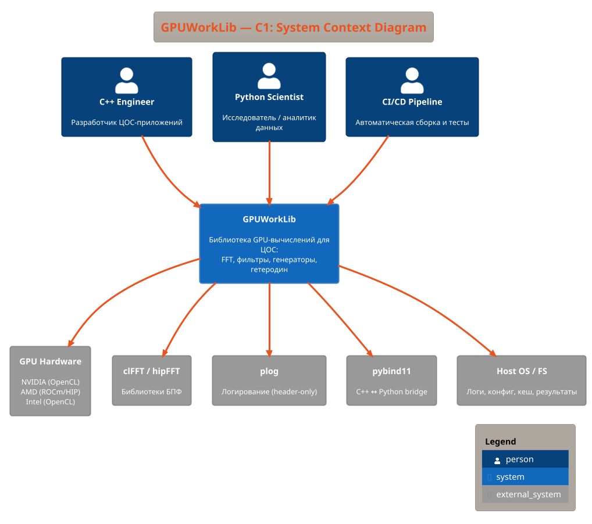

# C1 — System Context Diagram

> **Project**: GPUWorkLib
> **Date**: 2026-03-28
> **Reference**: [c4model.com](https://c4model.com)
> **Level**: 1 (System Context) — самый высокий уровень абстракции

---

## 1. Описание

**GPUWorkLib** — библиотека GPU-вычислений для цифровой обработки сигналов (ЦОС).
Предоставляет модули генерации, FFT, фильтрации, гетеродинирования и спектрального анализа.

---

## 2. System Context Diagram (ASCII)

```
 ┌──────────────────────────────────────────────────────────────────────┐
 │                        ПОЛЬЗОВАТЕЛИ                                 │
 │                                                                      │
 │  ┌─────────────┐   ┌─────────────────┐   ┌───────────────────┐     │
 │  │  C++ Dev    │   │  Python Data    │   │  CI/CD Pipeline   │     │
 │  │  (Engineer) │   │  Scientist      │   │  (GitHub Actions) │     │
 │  └──────┬──────┘   └───────┬─────────┘   └────────┬──────────┘     │
 └─────────┼──────────────────┼──────────────────────┼─────────────────┘
           │                  │                      │
           │ C++ API          │ Python API           │ cmake --build
           │ (include/*.hpp)  │ (pybind11/NumPy)     │ + ctest
           │                  │                      │
           ▼                  ▼                      ▼
 ┌──────────────────────────────────────────────────────────────────────┐
 │                                                                      │
 │                    ╔══════════════════════════╗                       │
 │                    ║      GPUWorkLib          ║                       │
 │                    ║                          ║                       │
 │                    ║  GPU Signal Processing   ║                       │
 │                    ║  Library                 ║                       │
 │                    ║                          ║                       │
 │                    ║  - Signal Generation     ║                       │
 │                    ║  - FFT / IFFT + Maxima   ║                       │
 │                    ║  - Statistics (Welford)  ║                       │
 │                    ║  - FIR / IIR Filters     ║                       │
 │                    ║  - Heterodyne Dechirp    ║                       │
 │                    ║  - Fractional Delay      ║                       │
 │                    ║  - FM Correlation        ║                       │
 │                    ║  - Digital Beamforming   ║                       │
 │                    ║  - MVDR Capon            ║                       │
 │                    ║  - 3D Range-Angle        ║                       │
 │                    ╚═══════════╤══════════════╝                       │
 │                                │                                     │
 └────────────────────────────────┼─────────────────────────────────────┘
                                  │
           ┌──────────────────────┼──────────────────────┐
           │                      │                      │
           ▼                      ▼                      ▼
 ┌─────────────────┐  ┌─────────────────┐  ┌──────────────────────┐
 │  GPU Hardware   │  │  External Libs  │  │  Host OS / FS        │
 │                 │  │                 │  │                      │
 │  NVIDIA (OpenCL)│  │  clFFT          │  │  Logs/DRVGPU_XX/     │
 │  AMD (ROCm/HIP)│  │  hipFFT         │  │  Results/JSON/       │
 │  Intel (OpenCL) │  │  plog           │  │  Results/Profiler/   │
 │                 │  │  pybind11       │  │  configGPU.json      │
 │  1..N устройств │  │  NumPy          │  │  Kernel cache (.bin) │
 └─────────────────┘  └─────────────────┘  └──────────────────────┘
```

---

## 3. Акторы и системы

### Пользователи (People)

| Актор | Описание | Взаимодействие |
|-------|----------|----------------|
| **C++ Engineer** | Разработчик ЦОС-приложений | Использует C++ API напрямую: `#include <drv_gpu.hpp>` |
| **Python Data Scientist** | Исследователь / аналитик | Использует Python API: `import gpu_worklib` |
| **CI/CD Pipeline** | Автоматизация сборки и тестов | CMake build + ctest (15 C++ тестов, 9+ Python тестов) |

### Внешние системы (External Systems)

| Система | Технология | Назначение |
|---------|-----------|------------|
| **GPU Hardware** | NVIDIA / AMD / Intel | Аппаратное ускорение (OpenCL / ROCm) |
| **clFFT** | C library | БПФ для OpenCL backend |
| **hipFFT** | C library | БПФ для ROCm backend |
| **plog** | C++ header-only | Логирование (per-GPU файлы) |
| **pybind11** | C++ ↔ Python bridge | Python-биндинги (NumPy integration) |
| **Host OS / FS** | Windows / Linux | Файловая система (логи, конфиг, кеш ядер, результаты) |

---

## 4. Границы системы

```
                    ┌─── Граница GPUWorkLib ───────────────────────┐
                    │                                               │
  User Code ──────▶ │  DrvGPU + Modules + Python Bindings         │
                    │                                               │
                    │  Ответственность:                             │
                    │  ✅ Абстракция GPU (multi-backend)            │
                    │  ✅ Управление памятью GPU                    │
                    │  ✅ Генерация сигналов (CW, LFM, Noise, DSL) │
                    │  ✅ FFT/IFFT с пост-обработкой                │
                    │  ✅ Поиск спектральных максимумов             │
                    │  ✅ FIR/IIR фильтрация                       │
                    │  ✅ Гетеродинирование (LFM Dechirp)          │
                    │  ✅ Дробная задержка (Lagrange/Farrow)        │
                    │  ✅ Профилирование и логирование              │
                    │  ✅ Batch-обработка больших данных             │
                    │                                               │
                    │  Вне ответственности:                         │
                    │  ❌ Установка GPU-драйверов                   │
                    │  ❌ Сборка clFFT/hipFFT (внешняя зависимость)│
                    │  ❌ GUI / визуализация (через Python)         │
                    │  ❌ Сетевые протоколы                         │
                    └───────────────────────────────────────────────┘
```

---

## 5. PlantUML (для рендеринга)



---

*Следующий уровень: [C2 — Container Diagram](Architecture_C2_Container.md)*
