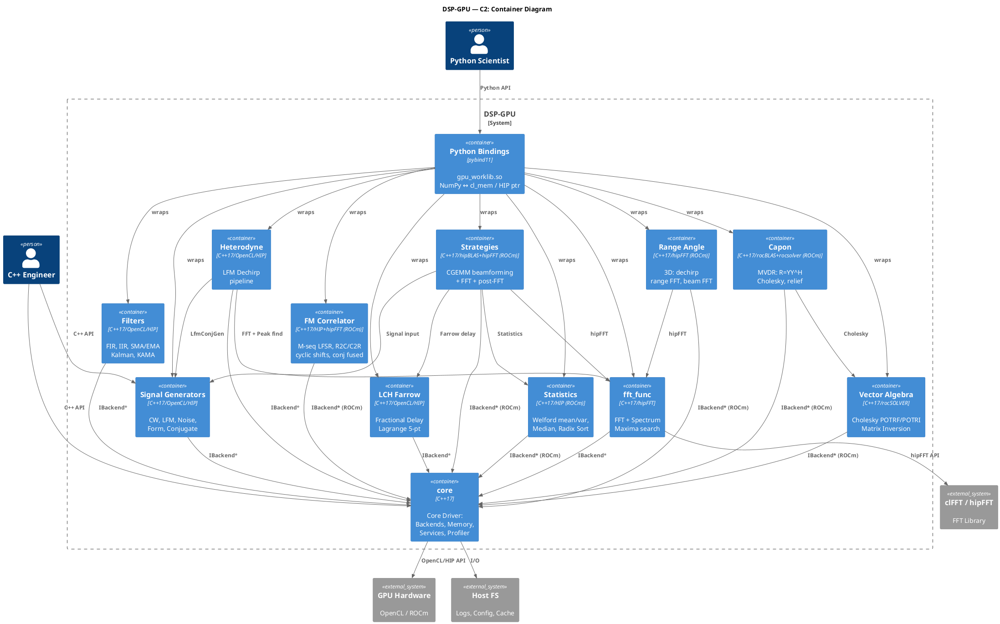

# C2 — Container Diagram

> **Project**: DSP-GPU
> **Date**: 2026-03-28
> **Reference**: [c4model.com](https://c4model.com)
> **Level**: 2 (Container) — основные "контейнеры" внутри системы

---

## 1. Описание

Container-уровень показывает основные развёртываемые/компилируемые единицы DSP-GPU:
библиотеки, модули, биндинги и инфраструктурные компоненты.

---

## 2. Container Diagram (ASCII)

```
  ┌─────────────┐     ┌──────────────────┐     ┌─────────────────┐
  │  C++ App    │     │  Python App      │     │  CI/CD          │
  │  (Engineer) │     │  (Scientist)     │     │  (cmake+ctest)  │
  └──────┬──────┘     └────────┬─────────┘     └────────┬────────┘
         │                     │                        │
         │ C++ API             │ Python API              │ Build
         ▼                     ▼                        ▼
  ═══════════════════════════════════════════════════════════════════
  ║                       DSP-GPU System                        ║
  ║                                                                 ║
  ║  ┌──────────────────────────────────────────────────────────┐  ║
  ║  │              Python Bindings (pybind11)                  │  ║
  ║  │  gpu_worklib.pyd / .so                                   │  ║
  ║  │  GPUContext, PySignalGenerator, PyFFTProcessor,          │  ║
  ║  │  PyHeterodyneDechirp, PyFilters, PyLchFarrow             │  ║
  ║  └──────────────────────────┬───────────────────────────────┘  ║
  ║                              │                                  ║
  ║  ┌───────────────────────────┴───────────────────────────────┐ ║
  ║  │                    Module Layer                            │ ║
  ║  │                                                            │ ║
  ║  │ ┌──────────────┐ ┌──────────────────────────────────────┐ │ ║
  ║  │ │ Signal       │ │ fft_func                             │ │ ║
  ║  │ │ Generators   │ │ (FFT Processor + SpectrumMaxima-     │ │ ║
  ║  │ │              │ │  Finder)                             │ │ ║
  ║  │ │ CW,LFM,Noise│ │ Complex,MagPhase,OnePeak,AllMaxima   │ │ ║
  ║  │ │ Form,Conj    │ │ hipFFT                               │ │ ║
  ║  │ └──────┬───────┘ └──────────────────┬───────────────────┘ │ ║
  ║  │        │                            │                      │ ║
  ║  │ ┌──────┴───────┐ ┌─────────────────┴┐ ┌──────────────────┐│ ║
  ║  │ │ Filters      │ │ Heterodyne       │ │ LCH Farrow       ││ ║
  ║  │ │              │ │ (Dechirp)        │ │ (Fractional Delay)││ ║
  ║  │ │ FIR,IIR,SMA  │ │ LFM Dechirp      │ │ Lagrange 5-point ││ ║
  ║  │ │ Kalman,KAMA  │ │ Pipeline         │ │ OpenCL+ROCm      ││ ║
  ║  │ │ OpenCL+ROCm  │ │                  │ │                  ││ ║
  ║  │ └──────┬───────┘ └──────┬───────────┘ └────────┬─────────┘│ ║
  ║  │        │                │                      │           │ ║
  ║  │ ┌──────┴───────┐ ┌─────┴────────┐ ┌───────────┴──────────┐│ ║
  ║  │ │ Statistics   │ │ Vector       │ │ FM Correlator        ││ ║
  ║  │ │ (ROCm only)  │ │ Algebra      │ │ (ROCm only)          ││ ║
  ║  │ │ Welford,     │ │ (ROCm only)  │ │ M-seq LFSR,          ││ ║
  ║  │ │ Median,RadixS│ │ Cholesky     │ │ R2C/C2R hipFFT       ││ ║
  ║  │ └──────┬───────┘ └──────┬───────┘ └──────────┬───────────┘│ ║
  ║  │        │                │                    │             │ ║
  ║  │ ┌──────┴───────┐ ┌─────┴────────┐ ┌─────────┴────────────┐│ ║
  ║  │ │ Strategies   │ │ Capon        │ │ Range Angle          ││ ║
  ║  │ │ (ROCm only)  │ │ (ROCm only)  │ │ (ROCm only)          ││ ║
  ║  │ │ CGEMM+FFT    │ │ MVDR         │ │ 3D FFT               ││ ║
  ║  │ │ beamforming  │ │ R^-1, relief │ │ dechirp+range+beam   ││ ║
  ║  │ └──────┬───────┘ └──────┬───────┘ └──────────┬───────────┘│ ║
  ║  │        │                │                    │             │ ║
  ║  └────────┼────────────────┼────────────────────┼────────────┘ ║
  ║           │                │                    │               ║
  ║  ┌────────┴────────────────┴────────────────────┴────────────┐ ║
  ║  │                     core (Core Driver)                  │ ║
  ║  │                                                            │ ║
  ║  │  ┌────────────┐  ┌──────────────┐  ┌──────────────────┐  │ ║
  ║  │  │ Backends   │  │ Memory       │  │ Services          │  │ ║
  ║  │  │            │  │ Manager      │  │                   │  │ ║
  ║  │  │ OpenCL     │  │ GPUBuffer<T> │  │ GPUProfiler       │  │ ║
  ║  │  │ ROCm/HIP   │  │ SVM Buffer   │  │ ConsoleOutput     │  │ ║
  ║  │  │ Hybrid     │  │              │  │ BatchManager      │  │ ║
  ║  │  │            │  │              │  │ KernelCache       │  │ ║
  ║  │  └────────────┘  └──────────────┘  └──────────────────┘  │ ║
  ║  │                                                            │ ║
  ║  │  ┌────────────┐  ┌──────────────┐  ┌──────────────────┐  │ ║
  ║  │  │ Logger     │  │ Config       │  │ Module Registry   │  │ ║
  ║  │  │ (plog)     │  │ (JSON)       │  │ (DI container)    │  │ ║
  ║  │  └────────────┘  └──────────────┘  └──────────────────┘  │ ║
  ║  └────────────────────────────┬───────────────────────────────┘ ║
  ║                               │                                  ║
  ═════════════════════════════════╪══════════════════════════════════
                                  │
                    ┌─────────────┼─────────────┐
                    ▼             ▼             ▼
          ┌──────────────┐ ┌──────────┐ ┌──────────────┐
          │ GPU Hardware │ │ clFFT /  │ │ Host FS      │
          │ (OpenCL/HIP) │ │ hipFFT   │ │ (Logs,Config)│
          └──────────────┘ └──────────┘ └──────────────┘
```

---

## 3. Таблица контейнеров

| # | Контейнер | Технология | Каталог | Назначение |
|---|-----------|-----------|---------|------------|
| 1 | **core** | C++17 / OpenCL / HIP | `core/` | Ядро: абстракция GPU, память, сервисы, профилирование |
| 2 | **fft_func** | C++17 / hipFFT | `modules/fft_func/` | Пакетный FFT + поиск максимумов спектра (объединяет fft_processor + fft_maxima) |
| 3 | **Statistics** | C++17 / HIP (ROCm) | `modules/statistics/` | Welford mean/variance, медиана, radix sort |
| 4 | **Vector Algebra** | C++17 / rocsolver (ROCm) | `modules/vector_algebra/` | Cholesky POTRF/POTRI инверсия матриц |
| 5 | **Filters** | C++17 / HIP kernels | `modules/filters/` | FIR, IIR, SMA/EMA/DEMA/TEMA, Kalman, KAMA |
| 6 | **Signal Generators** | C++17 / OpenCL / HIP | `modules/signal_generators/` | CW, LFM, Noise, FormSignal, DelayedFormSignal |
| 7 | **LCH Farrow** | C++17 / OpenCL / HIP | `modules/lch_farrow/` | Дробная задержка (Lagrange 48x5) |
| 8 | **Heterodyne** | C++17 / OpenCL / HIP | `modules/heterodyne/` | LFM Dechirp pipeline (дальнометрия) |
| 9 | **FM Correlator** | C++17 / HIP + hipFFT (ROCm) | `modules/fm_correlator/` | M-seq LFSR, R2C/C2R корреляция |
| 10 | **Strategies** | C++17 / hipBLAS + hipFFT (ROCm) | `modules/strategies/` | Цифровое ДН: CGEMM beamforming → FFT → post-FFT scenarios |
| 11 | **Capon** | C++17 / rocBLAS + rocsolver (ROCm) | `modules/capon/` | MVDR: R=YY^H/N+μI → Cholesky → relief / adaptive beamform |
| 12 | **Range Angle** | C++17 / hipFFT (ROCm) | `modules/range_angle/` | 3D: dechirp → range FFT → 2D beam FFT → peak search |
| 13 | **Python Bindings** | pybind11 / NumPy | `python/` | Python API: `gpu_worklib.so` |
| 14 | **Test Suite** | C++17 / TestRunner | `*/tests/`, `Python_test/` | C++ тесты (hpp) + Python тесты |

---

## 4. Зависимости между контейнерами

```
  Python Bindings ──────────────────────────────────┐
       │                                             │
       │ wraps all modules                           │
       ▼                                             ▼
  ┌────────────┐   ┌────────────┐   ┌────────────────────┐
  │ Signal     │   │ fft_func   │   │ Strategies         │
  │ Generators │   │ (FFT+Max)  │   │ (CGEMM+FFT)       │
  └─────┬──────┘   └─────┬──────┘   └──┬──────────┬─────┘
        │                │              │          │
        │                │              │          │
        │                │              ▼          ▼
  ┌─────┴──────┐   ┌─────┴──────┐   ┌────────────────────┐
  │ Filters    │   │ LCH Farrow │   │ Heterodyne         │
  │            │   │            │   │ (uses SigGen+FFT)  │
  └─────┬──────┘   └─────┬──────┘   └──────────┬─────────┘
        │                │                      │
  ┌─────┴──────┐   ┌─────┴──────┐   ┌──────────┴─────────┐
  │ Statistics │   │ Vector     │   │ FM Correlator      │
  │            │   │ Algebra    │   │                    │
  └─────┬──────┘   └─────┬──────┘   └──────────┬─────────┘
        │                │                      │
  ┌─────┴──────┐   ┌─────┴──────┐   ┌──────────┴─────────┐
  │ Capon      │   │ Range      │   │                    │
  │ (MVDR)     │   │ Angle (3D) │   │                    │
  └─────┬──────┘   └─────┬──────┘   └────────────────────┘
        │                │
        └────────────────┼──────────────────────┘
                         │
                         ▼
               ┌──────────────────┐
               │     core       │
               │  (IBackend*,     │
               │   MemoryManager, │
               │   Services)      │
               └────────┬─────────┘
                        │
              ┌─────────┼──────────┐
              ▼         ▼          ▼
         OpenCL      ROCm      Hybrid
         Backend     Backend   Backend
```

### Матрица зависимостей

| Модуль ↓ \ Зависит от → | core | SigGen | fft_func | Filters | Heterodyne | Farrow | Statistics | VecAlgebra | FMCorr | Strategies |
|--------------------------|:------:|:------:|:--------:|:-------:|:----------:|:------:|:----------:|:----------:|:------:|:----------:|
| **fft_func**             |   ✅   |   —    |    —     |   —     |     —      |   —    |     —      |     —      |   —    |     —      |
| **Statistics**           |   ✅   |   —    |    —     |   —     |     —      |   —    |     —      |     —      |   —    |     —      |
| **Vector Algebra**       |   ✅   |   —    |    —     |   —     |     —      |   —    |     —      |     —      |   —    |     —      |
| **Filters**              |   ✅   |   —    |    —     |   —     |     —      |   —    |     —      |     —      |   —    |     —      |
| **Signal Generators**    |   ✅   |   —    |    —     |   —     |     —      |   —    |     —      |     —      |   —    |     —      |
| **LCH Farrow**           |   ✅   |   —    |    —     |   —     |     —      |   —    |     —      |     —      |   —    |     —      |
| **Heterodyne**           |   ✅   |  ✅    |   ✅     |   —     |     —      |   —    |     —      |     —      |   —    |     —      |
| **FM Correlator**        |   ✅   |   —    |    —     |   —     |     —      |   —    |     —      |     —      |   —    |     —      |
| **Strategies**           |   ✅   |  ✅    |   ✅     |   —     |     —      |  ✅    |    ✅      |     —      |   —    |     —      |
| **Capon**                |   ✅   |   —    |    —     |   —     |     —      |   —    |     —      |    ✅      |   —    |     —      |
| **Range Angle**          |   ✅   |   —    |   ✅     |   —     |    ✅      |   —    |     —      |     —      |   —    |     —      |
| **Python Bindings**      |   ✅   |  ✅    |   ✅     |  ✅     |    ✅      |  ✅    |    ✅      |    ✅      |  ✅    |    ✅      |

---

## 5. Коммуникация между контейнерами

| Источник | Назначение | Протокол | Данные |
|----------|-----------|----------|--------|
| User C++ App | core | Direct C++ call | `core::Initialize()` |
| User Python App | Python Bindings | pybind11 | `GPUContext(0)` |
| Python Bindings | Все модули | Direct C++ call | NumPy → `cl_mem` |
| Signal Generators | core | `IBackend*` | `cl_mem` (GPU буфер) |
| FFT Processor | core | `IBackend*` | `cl_mem` input → `cl_mem` output |
| FFT Processor | clFFT | C API | `clfftEnqueueTransform()` |
| Heterodyne | Signal Generators | Factory | `LfmConjugateGenerator` |
| Heterodyne | FFT Processor | Direct | `ProcessComplex()` |
| Heterodyne | FFT Maxima | Direct | `FindAllMaxima()` |
| Все модули | GPUProfiler | Async queue | `profiler.Record()` |
| Все модули | ConsoleOutput | Async queue | `con.Print()` |
| core | GPU Hardware | OpenCL / HIP API | Kernel launch, memcpy |

---

## 6. PlantUML



---

*Предыдущий уровень: [C1 — System Context](Architecture_C1_SystemContext.md)*
*Следующий уровень: [C3 — Component Diagram](Architecture_C3_Component.md)*

*Last updated: 2026-03-28*
