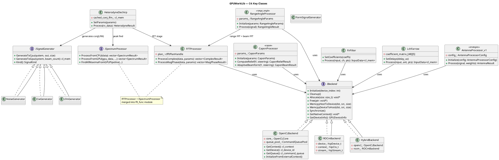

# C4 — Code-level Diagram

> **Project**: GPUWorkLib
> **Date**: 2026-03-28
> **Reference**: [c4model.com](https://c4model.com)
> **Level**: 4 (Code) — классы, интерфейсы, сигнатуры методов

---

## 1. DrvGPU — Core Classes

### 1.1 IBackend (Abstract Interface)

```cpp
// DrvGPU/interface/i_backend.hpp
class IBackend {
public:
    virtual ~IBackend() = default;

    // ─── Lifecycle ───
    virtual void Initialize(int device_index) = 0;
    virtual void Cleanup() = 0;
    virtual bool IsInitialized() const = 0;

    // ─── Resource Ownership ───
    virtual void SetOwnsResources(bool owns) = 0;
    virtual bool OwnsResources() const = 0;

    // ─── Device Info ───
    virtual GPUDeviceInfo GetDeviceInfo() const = 0;
    virtual std::string GetDeviceName() const = 0;

    // ─── Native Handles (для прямого доступа к OpenCL/HIP) ───
    virtual void* GetNativeContext() const = 0;
    virtual void* GetNativeDevice() const = 0;
    virtual void* GetNativeQueue() const = 0;

    // ─── Memory Operations ───
    virtual void* Allocate(size_t size_bytes, unsigned int flags = 0) = 0;
    virtual void  Free(void* ptr) = 0;
    virtual void  MemcpyHostToDevice(void* dst, const void* src, size_t bytes) = 0;
    virtual void  MemcpyDeviceToHost(void* dst, const void* src, size_t bytes) = 0;
    virtual void  MemcpyDeviceToDevice(void* dst, const void* src, size_t bytes) = 0;

    // ─── Synchronization ───
    virtual void Synchronize() = 0;
    virtual void Flush() = 0;

    // ─── Device Capabilities ───
    virtual bool   SupportsSVM() const = 0;
    virtual bool   SupportsDoublePrecision() const = 0;
    virtual size_t GetMaxWorkGroupSize() const = 0;
    virtual size_t GetGlobalMemorySize() const = 0;
    virtual size_t GetFreeMemorySize() const = 0;
};
```

### 1.2 DrvGPU (Main Driver)

```cpp
// DrvGPU/include/drv_gpu.hpp
class DrvGPU {
public:
    DrvGPU();
    ~DrvGPU();

    void Initialize();
    void Cleanup();
    void Synchronize();
    void Flush();

    MemoryManager&  GetMemoryManager();
    ModuleRegistry& GetModuleRegistry();
    IBackend&       GetBackend();
    GPUDeviceInfo   GetDeviceInfo();
    void            PrintStatistics();

private:
    std::unique_ptr<IBackend>       backend_;
    std::unique_ptr<MemoryManager>  memory_manager_;
    std::unique_ptr<ModuleRegistry> module_registry_;
    bool initialized_ = false;
};
```

### 1.3 OpenCLBackend

```cpp
// DrvGPU/backends/opencl/opencl_backend.hpp
class OpenCLBackend : public IBackend {
public:
    // Lifecycle
    void Initialize(int device_index) override;
    void InitializeFromExternalContext(cl_context, cl_device_id, cl_command_queue);
    void Cleanup() override;

    // OpenCL-specific accessors
    cl_context       GetContext() const;
    cl_device_id     GetDevice() const;
    cl_command_queue  GetQueue() const;
    CommandQueuePool& GetQueuePool();

    // IBackend implementation...
private:
    std::unique_ptr<OpenCLCore>        core_;
    std::unique_ptr<CommandQueuePool>  queue_pool_;
    bool owns_resources_ = true;
};
```

### 1.4 MemoryManager & GPUBuffer\<T\>

```cpp
// DrvGPU/memory/memory_manager.hpp
class MemoryManager {
public:
    explicit MemoryManager(IBackend* backend);

    template<typename T>
    std::shared_ptr<GPUBuffer<T>> CreateBuffer(size_t num_elements);

    void*  Allocate(size_t size_bytes);
    void   Free(void* ptr);
    size_t GetAllocationCount() const;
    size_t GetTotalAllocatedBytes() const;
    void   PrintStatistics() const;

private:
    IBackend* backend_;
    std::atomic<size_t> allocation_count_{0};
    std::atomic<size_t> total_bytes_{0};
};

// DrvGPU/memory/gpu_buffer.hpp
template<typename T>
class GPUBuffer {
public:
    GPUBuffer(IBackend* backend, size_t num_elements);
    ~GPUBuffer();  // RAII: calls backend_->Free(ptr_)

    void  Write(const void* host_data, size_t size_bytes);
    void  Read(void* host_data, size_t size_bytes) const;
    void* GetPtr() const;
    size_t GetNumElements() const;
    size_t GetSizeBytes() const;

private:
    IBackend* backend_;
    void*     ptr_ = nullptr;
    size_t    num_elements_;
};
```

### 1.5 GPUProfiler

```cpp
// DrvGPU/services/gpu_profiler.hpp
class GPUProfiler : public AsyncServiceBase<ProfilingMessage> {
public:
    static GPUProfiler& GetInstance();

    void Record(int gpu_id, const std::string& module,
                const std::string& event, const OpenCLProfilingData& data);

    void SetGPUInfo(int gpu_id, const GPUReportInfo& info);  // ⚠️ Вызвать ДО Start()!

    std::map<std::string, ModuleStats> GetStats(int gpu_id) const;

    void PrintReport() const;                        // Единственные
    bool ExportJSON(const std::string& path) const;  // допустимые
    bool ExportMarkdown(const std::string& path) const; // методы вывода

    void Start();
    void Stop();
};
```

---

## 2. Signal Generators — Classes

### 2.1 ISignalGenerator

```cpp
// modules/signal_generators/include/generators/i_signal_generator.hpp
class ISignalGenerator {
public:
    virtual ~ISignalGenerator() = default;

    virtual void GenerateToCpu(const SystemSampling& system,
                               std::complex<float>* out, size_t out_size) = 0;

    virtual cl_mem GenerateToGpu(const SystemSampling& system,
                                 size_t beam_count = 1) = 0;

    virtual SignalKind Kind() const = 0;
};
```

### 2.2 CwGenerator

```cpp
// modules/signal_generators/include/generators/cw_generator.hpp
struct CwParams {
    double f0 = 100.0;          // Frequency (Hz)
    double phase = 0.0;         // Initial phase (rad)
    double amplitude = 1.0;
    bool   complex_iq = true;
    double freq_step = 0.0;     // Multi-beam: f_i = f0 + i*freq_step
};

class CwGenerator : public ISignalGenerator {
public:
    CwGenerator(IBackend* backend, const CwParams& params);

    void   GenerateToCpu(...) override;
    cl_mem GenerateToGpu(...) override;
    SignalKind Kind() const override { return SignalKind::CW; }

private:
    IBackend*  backend_;
    CwParams   params_;
    cl_program program_;
    cl_kernel  kernel_;
};

// Formula: s(t) = A * exp(j * (2*pi*f*t + phase))
```

### 2.3 LfmGenerator

```cpp
// modules/signal_generators/include/generators/lfm_generator.hpp
struct LfmParams {
    double f_start = 100.0;
    double f_end = 500.0;
    double amplitude = 1.0;
    bool   complex_iq = true;

    double GetChirpRate(double duration) const {
        return (f_end - f_start) / duration;
    }
};

class LfmGenerator : public ISignalGenerator { /* ... */ };

// Formula: s(t) = A * exp(j * pi * k * t^2 + j * 2*pi*f_start*t)
//   where k = (f_end - f_start) / duration
```

### 2.4 FormSignalGenerator (DSL → Kernel)

```cpp
// modules/signal_generators/include/generators/form_signal_generator.hpp
class FormSignalGenerator {
public:
    FormSignalGenerator(IBackend* backend);

    void   LoadScript(const std::string& script_path);
    cl_mem Generate(size_t antennas, size_t points);

    // DSL: [Params], [Defs], [Signal] sections
    // Built-in vars: ID (antenna), T (sample)
    // Output: res (real) or res_re+res_im (complex IQ)

private:
    IBackend* backend_;
    std::string compiled_kernel_src_;
    cl_program  program_;
    cl_kernel   kernel_;
};
```

### 2.5 SignalGeneratorFactory

```cpp
// modules/signal_generators/include/signal_generator_factory.hpp
class SignalGeneratorFactory {
public:
    static std::unique_ptr<ISignalGenerator> Create(
        IBackend* backend, const SignalRequest& request);

    static std::unique_ptr<ISignalGenerator> CreateCw(
        IBackend* backend, const CwParams& params);
    static std::unique_ptr<ISignalGenerator> CreateLfm(
        IBackend* backend, const LfmParams& params);
    static std::unique_ptr<ISignalGenerator> CreateNoise(
        IBackend* backend, const NoiseParams& params);
};
```

---

## 3. fft_func — FFT Processor + Spectrum Maxima (merged module)

### 3.1 FFTProcessor

```cpp
// modules/fft_func/include/fft_processor.hpp

enum class FFTOutputMode { COMPLEX, MAGNITUDE_PHASE, MAGNITUDE_PHASE_FREQ };

struct FFTProcessorParams {
    uint32_t      beam_count;
    uint32_t      n_point;          // Input length (before padding)
    float         sample_rate;
    FFTOutputMode output_mode;
    bool          use_padding = true;
};

struct FFTComplexResult {
    std::vector<std::complex<float>> spectrum;
};

struct FFTMagPhaseResult {
    std::vector<float> magnitude;
    std::vector<float> phase;
    std::vector<float> frequency_hz;  // optional
};

class FFTProcessor {
public:
    explicit FFTProcessor(IBackend* backend);
    ~FFTProcessor();

    // ─── From CPU data ───
    std::vector<FFTComplexResult> ProcessComplex(
        const std::vector<std::complex<float>>& data,
        const FFTProcessorParams& params);

    std::vector<FFTMagPhaseResult> ProcessMagPhase(
        const std::vector<std::complex<float>>& data,
        const FFTProcessorParams& params);

    // ─── From GPU buffer (zero-copy) ───
    std::vector<FFTComplexResult> ProcessComplex(
        cl_mem gpu_data,
        const FFTProcessorParams& params,
        size_t gpu_memory_bytes = 0);

    std::vector<FFTMagPhaseResult> ProcessMagPhase(
        cl_mem gpu_data,
        const FFTProcessorParams& params,
        size_t gpu_memory_bytes = 0);

private:
    IBackend* backend_;
    // clFFT plan (cached per FFT size)
    clfftPlanHandle plan_;
    cl_mem pre_callback_userdata_;
    cl_mem fft_input_;
    cl_mem fft_output_;
    cl_mem mag_output_;
    cl_mem phase_output_;
};
```

### 3.2 ISpectrumProcessor (Maxima Finder)

```cpp
// modules/fft_func/include/processors/i_spectrum_processor.hpp

enum class SpectrumMode { ONE_PEAK, TWO_PEAKS, ALL_MAXIMA };
enum class OutputDestination { CPU, GPU };

struct SpectrumParams {
    uint32_t antenna_count;
    uint32_t n_point;
    uint32_t nFFT;
    float    sample_rate;
    SpectrumMode mode;
};

struct SpectrumResult {
    uint32_t antenna_idx;
    float    peak_freq_hz;
    float    peak_bin;
    float    peak_amplitude;
    float    peak_snr_db;
    float    second_peak_freq_hz;    // TWO_PEAKS only
    float    second_peak_amplitude;  // TWO_PEAKS only
};

struct AllMaximaResult {
    std::vector<PeakInfo> peaks;
    uint32_t num_peaks;
    float    runtime_ms;
};

class ISpectrumProcessor {
public:
    virtual void Initialize(const SpectrumParams& params) = 0;
    virtual bool IsInitialized() const = 0;

    virtual std::vector<SpectrumResult> ProcessFromCPU(
        const std::vector<std::complex<float>>& data) = 0;

    virtual std::vector<SpectrumResult> ProcessFromGPU(
        void* gpu_data, size_t antenna_count, size_t n_point,
        size_t gpu_memory_bytes = 0) = 0;

    virtual AllMaximaResult FindAllMaximaFromCPU(
        const std::vector<std::complex<float>>& data,
        OutputDestination dest, uint32_t search_start, uint32_t search_end) = 0;

    virtual AllMaximaResult FindAllMaximaFromGPUPipeline(
        void* gpu_data, size_t antenna_count, size_t n_point,
        size_t gpu_memory_bytes,
        OutputDestination dest, uint32_t search_start, uint32_t search_end) = 0;
};
```

---

## 4. Heterodyne — Classes

```cpp
// modules/heterodyne/include/heterodyne_dechirp.hpp

struct HeterodyneParams {
    float f_start;       // LFM start frequency (Hz)
    float f_end;         // LFM end frequency (Hz)
    float sample_rate;
    int   num_samples;
    int   num_antennas;

    float GetBandwidth() const { return f_end - f_start; }
    float GetDuration()  const { return num_samples / sample_rate; }
    float GetChirpRate() const { return GetBandwidth() / GetDuration(); }
};

struct AntennaDechirpResult {
    int   antenna_idx;
    float f_beat_hz;
    float f_beat_bin;
    float range_m;          // Range = c * T * f_beat / (2 * B)
    float peak_amplitude;
    float peak_snr_db;
};

struct HeterodyneResult {
    bool success;
    std::vector<AntennaDechirpResult> antennas;
    std::vector<float> max_positions;
    std::string error_message;
};

class HeterodyneDechirp {
public:
    explicit HeterodyneDechirp(IBackend* backend,
                               BackendType compute_backend = BackendType::OPENCL);
    ~HeterodyneDechirp();

    void SetParams(const HeterodyneParams& params);

    HeterodyneResult Process(const std::vector<std::complex<float>>& rx_data);
    HeterodyneResult ProcessExternal(void* rx_gpu_ptr, const HeterodyneParams& params);

private:
    IBackend* backend_;
    HeterodyneParams params_;
    std::unique_ptr<IHeterodyneProcessor> processor_;
    cl_mem cached_conj_lfm_ = nullptr;  // OPT-4: кеш conj(LFM)
};
```

---

## 5. Filters — Classes

```cpp
// modules/filters/include/filters/fir_filter.hpp
class FirFilter {
public:
    explicit FirFilter(IBackend* backend);

    void LoadConfig(const std::string& json_path);
    void SetCoefficients(const std::vector<float>& coeffs);

    InputData<cl_mem> Process(cl_mem input_buf, uint32_t channels, uint32_t points);

    std::vector<std::complex<float>> ProcessCpu(
        const std::vector<std::complex<float>>& input,
        uint32_t channels, uint32_t points);

    uint32_t GetNumTaps() const;
    const std::vector<float>& GetCoefficients() const;

private:
    IBackend* backend_;
    std::vector<float> coefficients_;
    cl_program program_;
    cl_kernel  kernel_;
    cl_mem     coeff_buf_;  // __constant or __global
};
```

```cpp
// modules/filters/include/filters/iir_filter.hpp
class IirFilter {
public:
    explicit IirFilter(IBackend* backend);

    void SetCoefficients(const std::vector<float>& a_coeffs,
                         const std::vector<float>& b_coeffs);

    InputData<cl_mem> Process(cl_mem input_buf, uint32_t channels, uint32_t points);

private:
    IBackend* backend_;
    std::vector<float> a_coeffs_, b_coeffs_;
};
```

---

## 6. LCH Farrow — Classes

```cpp
// modules/lch_farrow/include/lch_farrow.hpp
class LchFarrow {
public:
    explicit LchFarrow(IBackend* backend);

    void SetDelays(const std::vector<float>& delay_us);
    void SetSampleRate(float sample_rate);
    void SetNoise(float noise_amplitude, float norm_val = 0.7071f, uint32_t seed = 0);
    void LoadMatrix(const std::string& json_path);

    InputData<cl_mem> Process(cl_mem input_buf, uint32_t antennas, uint32_t points);

    std::vector<std::vector<std::complex<float>>> ProcessCpu(
        const std::vector<std::vector<std::complex<float>>>& input,
        uint32_t antennas, uint32_t points);

private:
    IBackend* backend_;
    std::vector<float> delays_us_;
    float sample_rate_;
    float coefficient_matrix_[48][5];  // Lagrange 5-point, 48 sub-positions
    cl_mem matrix_buf_;
    cl_mem delays_buf_;
};
```

---

## 7. Strategies — Classes

```cpp
// modules/strategies/include/antenna_processor_v1.hpp

namespace strategies {

enum class PostFftScenarioMode {
    ALL_REQUIRED,      // Compute all post-FFT statistics
    ONE_MAX_PARABOLA,  // Single peak with parabolic interpolation
    ALL_MAXIMA,        // All peaks above threshold
    GLOBAL_MINMAX      // Global min/max across spectrum
};

struct AntennaProcessorConfig {
    int   n_ant;            // Number of antennas
    int   n_samples;        // Samples per antenna
    float sample_rate;      // Sample rate (Hz)
    PostFftScenarioMode scenario_mode;
};

struct AntennaResult {
    std::vector<float> pre_stats;        // Pre-processing statistics
    std::vector<float> post_gemm_stats;  // Post-CGEMM statistics
    std::vector<float> post_fft_stats;   // Post-FFT statistics
    // Scenario-dependent results:
    float  one_max_freq_hz;              // ONE_MAX_PARABOLA
    float  one_max_amplitude;
    std::vector<float> all_maxima_freqs; // ALL_MAXIMA
    float  global_min;                   // GLOBAL_MINMAX
    float  global_max;
};

class AntennaProcessor_v1 {
public:
    explicit AntennaProcessor_v1(IBackend* backend);
    ~AntennaProcessor_v1();

    void Initialize(AntennaProcessorConfig config);

    AntennaResult Process(const std::complex<float>* signal,
                          const std::complex<float>* weights);

private:
    IBackend* backend_;
    AntennaProcessorConfig config_;
    // Internal: StatisticsProcessor, hipBLAS handle, hipFFT plan
};

} // namespace strategies
```

---

## 8. Capon — Classes

```cpp
// modules/capon/include/capon_processor.hpp

namespace capon {

struct CaponParams {
    int   n_channels;    // P — number of antenna channels
    int   n_samples;     // N — number of time samples
    int   n_directions;  // M — number of steering directions
    float mu;            // Diagonal loading factor (regularization)
};

struct CaponReliefResult {
    std::vector<float> relief;   // z[M] — spatial power spectrum
    float runtime_ms;
};

struct CaponBeamResult {
    std::vector<std::complex<float>> output;  // Y_out[M x N] — beamformed output
    float runtime_ms;
};

class CaponProcessor {
public:
    explicit CaponProcessor(IBackend* backend);
    ~CaponProcessor();

    void Initialize(CaponParams params);

    // MVDR spatial power spectrum: z[m] = 1 / Re(u^H * R^-1 * u)
    CaponReliefResult ComputeRelief(const std::complex<float>* Y,
                                     const std::complex<float>* steering);

    // Adaptive beamforming: W = R^-1 * U, Y_out = W^H * Y
    CaponBeamResult AdaptiveBeamform(const std::complex<float>* Y,
                                      const std::complex<float>* steering);

private:
    IBackend* backend_;
    CaponParams params_;
    // Internal: CovarianceMatrixOp, CaponInvertOp (Cholesky), CaponReliefOp
};

} // namespace capon
```

---

## 9. Range Angle — Classes

```cpp
// modules/range_angle/include/range_angle_processor.hpp

namespace range_angle {

struct RangeAngleParams {
    int   n_ant_az;       // Number of azimuth antennas
    int   n_ant_el;       // Number of elevation antennas
    int   n_samples;      // Samples per antenna
    float f_start;        // LFM start frequency (Hz)
    float f_end;          // LFM end frequency (Hz)
    float sample_rate;    // Sample rate (Hz)
};

struct TargetInfo {
    float range_m;        // Estimated range (meters)
    float angle_az_deg;   // Azimuth angle (degrees)
    float angle_el_deg;   // Elevation angle (degrees)
    float power_db;       // Peak power (dB)
    float snr_db;         // Signal-to-noise ratio (dB)
};

struct RangeAngleResult {
    std::vector<TargetInfo> targets;
    // Power cube dimensions: [n_range_bins x n_ant_az x n_ant_el]
    std::vector<float> power_cube;
    int n_range_bins;
    float runtime_ms;
};

class RangeAngleProcessor {
public:
    explicit RangeAngleProcessor(IBackend* backend);
    ~RangeAngleProcessor();

    void Initialize(RangeAngleParams params);

    RangeAngleResult Process(const std::complex<float>* signal);

private:
    IBackend* backend_;
    RangeAngleParams params_;
    // Internal: DechirpWindowOp, RangeFftOp, TransposeOp, BeamFftOp, PeakSearchOp
};

} // namespace range_angle
```

---

## 10. UML Class Diagram (Pseudocode)

```
┌──────────────────────┐
│    <<interface>>      │
│      IBackend         │
├──────────────────────┤
│ + Initialize()        │
│ + Cleanup()           │
│ + Allocate()          │
│ + Free()              │
│ + MemcpyH2D/D2H/D2D()│
│ + Synchronize()       │
│ + GetNativeContext()   │
│ + GetDeviceInfo()     │
└──────────┬───────────┘
           │ implements
    ┌──────┼──────────────────┐
    │      │                  │
    ▼      ▼                  ▼
┌────────┐ ┌────────┐ ┌───────────┐
│OpenCL  │ │ ROCm   │ │ Hybrid    │
│Backend │ │ Backend│ │ Backend   │
└───┬────┘ └───┬────┘ └─────┬─────┘
    │          │             │
    │ has      │             │
    ▼          │             │
┌────────────┐ │             │
│OpenCLCore  │ │             │
│CmdQueuePool│ │             │
└────────────┘ │             │
               ▼             │
          ┌──────────┐       │
          │ZeroCopy  │       │
          │Bridge    │       │
          └──────────┘       │
                             ▼
                     ┌───────────────┐
                     │ OpenCLBackend │ ←── delegates
                     │ + ROCmBackend │
                     └───────────────┘

┌──────────────────────┐          ┌──────────────────────┐
│    <<interface>>      │          │    <<interface>>      │
│  ISignalGenerator     │          │  ISpectrumProcessor   │
├──────────────────────┤          ├──────────────────────┤
│ + GenerateToCpu()     │          │ + ProcessFromCPU()    │
│ + GenerateToGpu()     │          │ + ProcessFromGPU()    │
│ + Kind()              │          │ + FindAllMaxima()     │
└──────────┬───────────┘          └──────────┬───────────┘
           │ implements                       │ implements
    ┌──────┼──────┬──────┐             ┌──────┼──────┐
    ▼      ▼      ▼      ▼             ▼             ▼
┌──────┐┌─────┐┌─────┐┌──────┐  ┌──────────┐  ┌──────────┐
│CwGen ││LfmG ││Noise││FormSG│  │Spectrum   │  │Spectrum   │
│      ││     ││Gen  ││      │  │Proc_OpenCL│  │Proc_ROCm │
└──────┘└─────┘└─────┘└──────┘  └──────────┘  └──────────┘

┌──────────────────────┐
│  HeterodyneDechirp   │──── uses ──→ ISignalGenerator
│  (Facade)            │──── uses ──→ FFTProcessor (fft_func)
├──────────────────────┤──── uses ──→ ISpectrumProcessor (fft_func)
│ + SetParams()        │
│ + Process()          │
│ + ProcessExternal()  │
│ - cached_conj_lfm_   │
└──────────────────────┘

┌──────────────────────────┐
│  AntennaProcessor_v1     │──── uses ──→ StatisticsProcessor
│  (strategies)            │──── uses ──→ hipBLAS (CGEMM)
├──────────────────────────┤──── uses ──→ hipFFT
│ + Initialize(config)     │──── uses ──→ PostFFT Scenario
│ + Process(signal, weights)│
│ - config_                │
└──────────────────────────┘

┌──────────────────────────┐
│  CaponProcessor          │──── uses ──→ CovarianceMatrixOp (rocBLAS)
│  (capon)                 │──── uses ──→ CaponInvertOp (Cholesky)
├──────────────────────────┤──── uses ──→ CaponReliefOp
│ + Initialize(params)     │
│ + ComputeRelief(Y, steer)│
│ + AdaptiveBeamform(Y, st)│
│ - params_                │
└──────────────────────────┘

┌──────────────────────────┐
│  RangeAngleProcessor     │──── uses ──→ DechirpWindowOp
│  (range_angle)           │──── uses ──→ RangeFftOp (hipFFT)
├──────────────────────────┤──── uses ──→ TransposeOp
│ + Initialize(params)     │──── uses ──→ BeamFftOp (2D spatial FFT)
│ + Process(signal)        │──── uses ──→ PeakSearchOp
│ - params_                │
└──────────────────────────┘
```

---

## 11. PlantUML



---

---

*Last updated: 2026-03-28*

*Предыдущий уровень: [C3 — Component Diagram](Architecture_C3_Component.md)*
*Следующий документ: [DFD — Data Flow Diagram](Architecture_DFD.md)*
