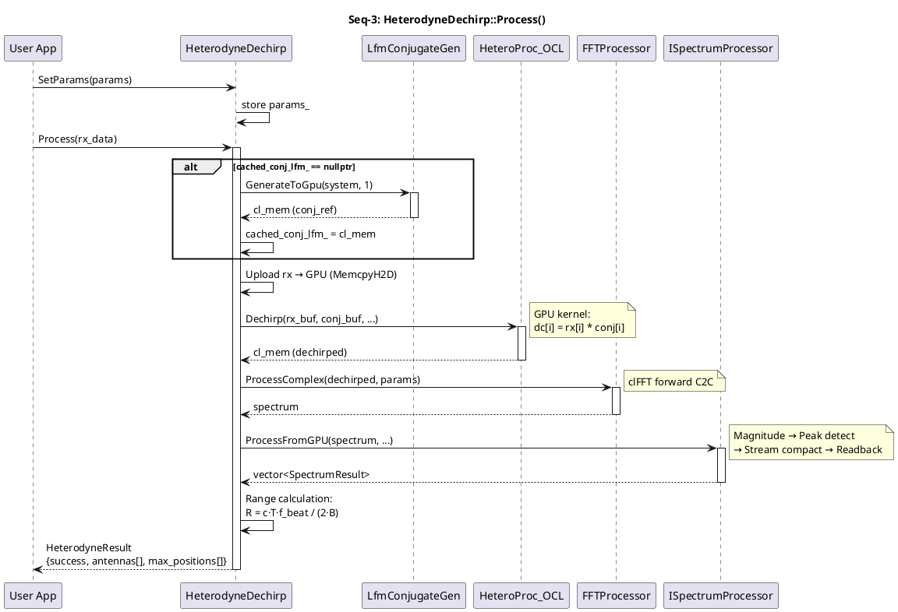
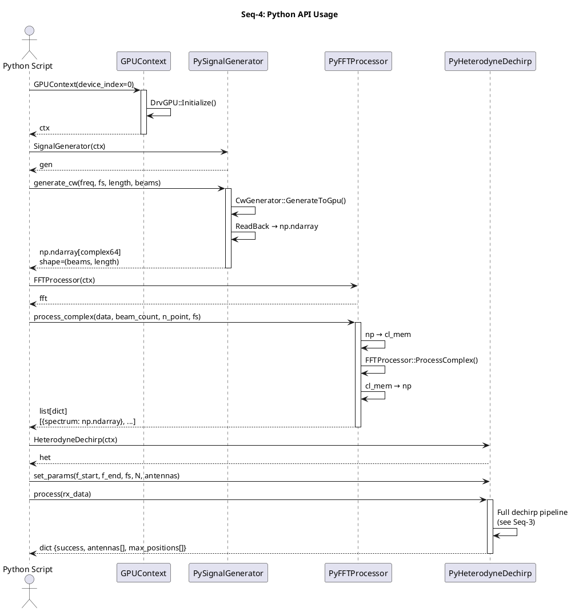
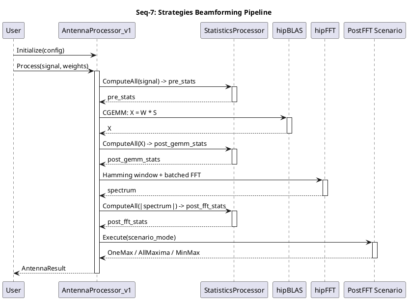
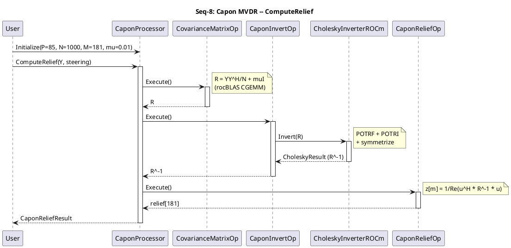
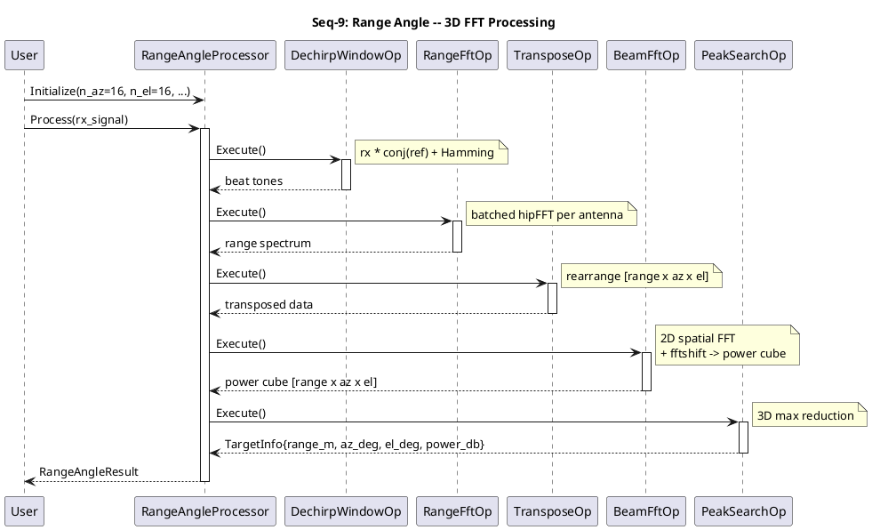

# Seq — Sequence Diagrams

> **Project**: GPUWorkLib
> **Date**: 2026-03-28
> **Notation**: UML Sequence Diagrams (ASCII + PlantUML)

---

## Sequence Diagram Index

| # | Diagram | Description |
|---|---------|-------------|
| Seq-1 | DrvGPU Initialization | GPU device initialization lifecycle |
| Seq-2 | Signal Generation → FFT → Peak | Typical signal processing pipeline |
| Seq-3 | Heterodyne LFM Dechirp | Full dechirp pipeline (conj, multiply, FFT, peak) |
| Seq-4 | Python API Usage | Typical Python-user scenario |
| Seq-5 | Multi-GPU Batch Processing | Batch dispatch across multiple GPUs |
| Seq-6 | Profiling & Reporting | GPUProfiler async recording and export |
| Seq-7 | Strategies Beamforming Pipeline | AntennaProcessor_v1: Stats → CGEMM → FFT → PostFFT |
| Seq-8 | Capon MVDR Relief | CaponProcessor: Covariance → Cholesky → Relief |
| Seq-9 | Range Angle 3D Processing | RangeAngleProcessor: Dechirp → RangeFFT → BeamFFT → Peak |

---

## Seq-1: DrvGPU Initialization

Инициализация одного GPU-устройства.

```
 User App          DrvGPU          GPUConfig       OpenCLBackend      OpenCLCore     ConsoleOutput   Logger
    │                 │                │                 │                │                │            │
    │ DrvGPU()        │                │                 │                │                │            │
    ├────────────────▶│                │                 │                │                │            │
    │                 │ LoadConfig()   │                 │                │                │            │
    │                 ├───────────────▶│                 │                │                │            │
    │                 │ ◄──── config ──┤                 │                │                │            │
    │                 │                │                 │                │                │            │
    │ Initialize()    │                │                 │                │                │            │
    ├────────────────▶│                │                 │                │                │            │
    │                 │  new OpenCLBackend()             │                │                │            │
    │                 ├────────────────────────────────▶│                │                │            │
    │                 │                │                 │                │                │            │
    │                 │  Initialize(device_index)        │                │                │            │
    │                 ├────────────────────────────────▶│                │                │            │
    │                 │                │                 │ InitCore()     │                │            │
    │                 │                │                 ├───────────────▶│                │            │
    │                 │                │                 │                │ clGetPlatform  │            │
    │                 │                │                 │                │ clCreateCtx    │            │
    │                 │                │                 │                │ clCreateQueue  │            │
    │                 │                │                 │  ◄── OK ──────┤                │            │
    │                 │                │                 │                │                │            │
    │                 │                │                 │ InitQueuePool()│                │            │
    │                 │                │                 ├───────────────▶│                │            │
    │                 │  ◄──────── initialized ─────────┤                │                │            │
    │                 │                │                 │                │                │            │
    │                 │  new MemoryManager(backend)      │                │                │            │
    │                 │  new ModuleRegistry()            │                │                │            │
    │                 │                │                 │                │                │            │
    │                 │  Print("GPU initialized")        │                │                │            │
    │                 ├──────────────────────────────────────────────────────────────────▶│            │
    │                 │                │                 │                │                │            │
    │                 │  LOG_INFO("DrvGPU ready")        │                │                │            │
    │                 ├───────────────────────────────────────────────────────────────────────────────▶│
    │  ◄──── OK ──────┤                │                 │                │                │            │
    │                 │                │                 │                │                │            │
```

---

## Seq-2: Signal Generation → FFT → Peak Detection

Типичный pipeline: генерация CW сигнала → FFT → поиск максимума.

```
 User App       SigGenFactory    CwGenerator     FFTProcessor      clFFT       SpectrumProc    GPUProfiler
    │                │                │                │              │              │              │
    │ Create(CW)     │                │                │              │              │              │
    ├───────────────▶│                │                │              │              │              │
    │                │ new CwGen()    │                │              │              │              │
    │                ├───────────────▶│                │              │              │              │
    │ ◄── ptr ───────┤                │                │              │              │              │
    │                                 │                │              │              │              │
    │ GenerateToGpu(system, beams)    │                │              │              │              │
    ├────────────────────────────────▶│                │              │              │              │
    │                                 │ Allocate(N*beams*8B)          │              │              │
    │                                 │ clCreateKernel("cw_gen")     │              │              │
    │                                 │ clEnqueueNDRange             │              │              │
    │                                 │ Record(profiler)              │              │              │
    │                                 ├──────────────────────────────────────────────────────────▶│
    │ ◄── cl_mem ────────────────────┤                │              │              │              │
    │                                                  │              │              │              │
    │ ProcessComplex(cl_mem, params)                   │              │              │              │
    ├─────────────────────────────────────────────────▶│              │              │              │
    │                                                  │ pad_kernel   │              │              │
    │                                                  │ (pre-callback)              │              │
    │                                                  │              │              │              │
    │                                                  │ clfftEnqueue │              │              │
    │                                                  ├─────────────▶│              │              │
    │                                                  │ ◄── done ────┤              │              │
    │                                                  │              │              │              │
    │                                                  │ Record()     │              │              │
    │                                                  ├──────────────────────────────────────────▶│
    │ ◄── vector<FFTComplexResult> ───────────────────┤              │              │              │
    │                                                                 │              │              │
    │ ProcessFromGPU(spectrum_cl_mem, antennas, nFFT)                 │              │              │
    ├────────────────────────────────────────────────────────────────────────────────▶│              │
    │                                                                 │              │              │
    │                                                                 │  magnitude   │              │
    │                                                                 │  kernel      │              │
    │                                                                 │              │              │
    │                                                                 │  peak_detect │              │
    │                                                                 │  kernel      │              │
    │                                                                 │              │              │
    │                                                                 │  readback    │              │
    │                                                                 │              │ Record()     │
    │                                                                 │              ├─────────────▶│
    │ ◄── vector<SpectrumResult> ────────────────────────────────────────────────────┤              │
    │                                                                                               │
```

---

## Seq-3: Heterodyne LFM Dechirp Pipeline

Полный цикл дечирпирования.

```
 User App      HeterodyneDechirp   LfmConjGen      HeteroProc_OCL   FFTProcessor    SpectrumProc
    │                │                  │                │                │               │
    │ SetParams()    │                  │                │                │               │
    ├───────────────▶│                  │                │                │               │
    │                │ store params_    │                │                │               │
    │                │                  │                │                │               │
    │ Process(rx)    │                  │                │                │               │
    ├───────────────▶│                  │                │                │               │
    │                │                  │                │                │               │
    │                │ ┌── cache check ─┐               │                │               │
    │                │ │ conj_lfm_      │               │                │               │
    │                │ │ exists?        │               │                │               │
    │                │ └───┬────────────┘               │                │               │
    │                │     │ NO (first call)            │                │               │
    │                │     ▼                            │                │               │
    │                │ GenerateToGpu()                  │                │               │
    │                ├─────────────────▶│                │                │               │
    │                │                  │ Build kernel   │                │               │
    │                │                  │ Generate conj  │                │               │
    │                │ ◄─ cl_mem ──────┤                │                │               │
    │                │ cache_conj_lfm_ = cl_mem         │                │               │
    │                │                                  │                │               │
    │                │ Upload rx → GPU                  │                │               │
    │                │ MemcpyHostToDevice(rx_buf)       │                │               │
    │                │                                  │                │               │
    │                │ Dechirp(rx_buf, conj_buf)        │                │               │
    │                ├─────────────────────────────────▶│                │               │
    │                │                                  │ GPU kernel:    │               │
    │                │                                  │ dc[i] = rx[i]  │               │
    │                │                                  │   * conj[i]    │               │
    │                │ ◄── cl_mem (dechirped) ─────────┤                │               │
    │                │                                  │                │               │
    │                │ ProcessComplex(dechirped, params) │                │               │
    │                ├──────────────────────────────────────────────────▶│               │
    │                │                                  │                │ clFFT fwd     │
    │                │ ◄── spectrum ────────────────────────────────────┤               │
    │                │                                  │                │               │
    │                │ ProcessFromGPU(spectrum, ...)     │                │               │
    │                ├──────────────────────────────────────────────────────────────────▶│
    │                │                                  │                │               │
    │                │                                  │                │               │ peak detect
    │                │                                  │                │               │ magnitude
    │                │                                  │                │               │ scan+compact
    │                │ ◄── SpectrumResult[] ────────────────────────────────────────────┤
    │                │                                  │                │               │
    │                │ ┌── Range Calculation ──────────────────────┐    │               │
    │                │ │ for each antenna:                          │    │               │
    │                │ │   f_beat = result.peak_freq_hz             │    │               │
    │                │ │   range = c * T * f_beat / (2 * B)         │    │               │
    │                │ │   snr_db = result.peak_snr_db              │    │               │
    │                │ └────────────────────────────────────────────┘    │               │
    │                │                                  │                │               │
    │ ◄── HeterodyneResult ─────────────────────────┤                │               │
    │    { success=true,                              │                │               │
    │      antennas[ { f_beat, range_m, snr } ],      │                │               │
    │      max_positions[] }                           │                │               │
    │                                                  │                │               │
```

---

## Seq-4: Python API Usage

Типичный сценарий Python-пользователя.

```
 Python Script        GPUContext      PySignalGen     PyFFTProcessor   PyHeterodyne
    │                    │                │                │               │
    │ ctx = GPUContext(0)│                │                │               │
    ├───────────────────▶│                │                │               │
    │                    │ DrvGPU()       │                │               │
    │                    │ Initialize()   │                │               │
    │ ◄── ctx ──────────┤                │                │               │
    │                    │                │                │               │
    │ gen = SignalGenerator(ctx)          │                │               │
    ├───────────────────────────────────▶│                │               │
    │ ◄── gen ─────────────────────────┤                │               │
    │                                    │                │               │
    │ data = gen.generate_cw(            │                │               │
    │   freq=1000, fs=44100,             │                │               │
    │   length=4096, beams=8)            │                │               │
    ├───────────────────────────────────▶│                │               │
    │                    │                │ CwGenerator::  │               │
    │                    │                │ GenerateToGpu()│               │
    │                    │                │ ReadBack to    │               │
    │                    │                │ np.ndarray     │               │
    │ ◄── np.ndarray[complex64] ────────┤                │               │
    │    shape=(8, 4096)                  │                │               │
    │                                    │                │               │
    │ fft = FFTProcessor(ctx)            │                │               │
    ├────────────────────────────────────────────────────▶│               │
    │ ◄── fft ─────────────────────────────────────────┤               │
    │                                    │                │               │
    │ result = fft.process_complex(data, │                │               │
    │   beam_count=8, n_point=4096,      │                │               │
    │   sample_rate=44100.0)             │                │               │
    ├────────────────────────────────────────────────────▶│               │
    │                    │                │ np → cl_mem    │               │
    │                    │                │ FFTProcessor:: │               │
    │                    │                │ ProcessComplex │               │
    │                    │                │ cl_mem → np    │               │
    │ ◄── list[dict] ────────────────────────────────────┤               │
    │    [{'spectrum': np.ndarray}, ...]  │                │               │
    │                                    │                │               │
    │ het = HeterodyneDechirp(ctx)       │                │               │
    ├───────────────────────────────────────────────────────────────────▶│
    │                    │                │                │               │
    │ het.set_params(f_start=1e6,        │                │               │
    │   f_end=10e6, fs=50e6,             │                │               │
    │   num_samples=4096,                │                │               │
    │   num_antennas=4)                  │                │               │
    ├───────────────────────────────────────────────────────────────────▶│
    │                    │                │                │               │
    │ result = het.process(rx_data)       │                │               │
    ├───────────────────────────────────────────────────────────────────▶│
    │                    │                │                │               │
    │                    │                │                │  Full pipeline│
    │                    │                │                │  (Seq-3)      │
    │                    │                │                │               │
    │ ◄── dict ──────────────────────────────────────────────────────────┤
    │    {'success': True,                │                │               │
    │     'antennas': [                   │                │               │
    │       {'f_beat_hz': 500000.0,       │                │               │
    │        'range_m': 1500.0,           │                │               │
    │        'peak_snr_db': 45.2}, ...],  │                │               │
    │     'max_positions': [...]}         │                │               │
    │                                    │                │               │
```

---

## Seq-5: Multi-GPU Batch Processing

Обработка большого массива данных на нескольких GPU.

```
 User App         BatchManager       DrvGPU[0]        DrvGPU[1]        DrvGPU[N]
    │                  │                │                │                │
    │ CalcOptBatch()   │                │                │                │
    ├─────────────────▶│                │                │                │
    │                  │ GetFreeMemory()│                │                │
    │                  ├───────────────▶│                │                │
    │                  │ ◄── free_mem ──┤                │                │
    │                  │                │                │                │
    │                  │ batch_size = min(total,          │                │
    │                  │   free_mem * 0.7 / item_bytes)  │                │
    │ ◄── batch_size ──┤                │                │                │
    │                  │                │                │                │
    │ CreateBatches()  │                │                │                │
    ├─────────────────▶│                │                │                │
    │ ◄── BatchRange[] ┤                │                │                │
    │    [{0..1000},    │                │                │                │
    │     {1000..2000}, │                │                │                │
    │     {2000..2847}] │ (tail merged) │                │                │
    │                  │                │                │                │
    │ ┌── Parallel dispatch (per GPU) ─────────────────────────────────┐│
    │ │                │                │                │                ││
    │ │ Process(batch[0])               │                │                ││
    │ ├────────────────────────────────▶│                │                ││
    │ │                │                │                │                ││
    │ │ Process(batch[1])                                │                ││
    │ ├──────────────────────────────────────────────────▶│               ││
    │ │                │                │                │                ││
    │ │ Process(batch[2])                                                 ││
    │ ├──────────────────────────────────────────────────────────────────▶││
    │ │                │                │                │                ││
    │ │ ◄── results[0] ────────────────┤                │                ││
    │ │ ◄── results[1] ─────────────────────────────────┤                ││
    │ │ ◄── results[2] ──────────────────────────────────────────────────┤│
    │ └────────────────────────────────────────────────────────────────────┘
    │                  │                │                │                │
    │ Merge results    │                │                │                │
    │                  │                │                │                │
```

---

## Seq-6: Profiling & Reporting

```
 Module Code       GPUProfiler         AsyncQueue       File System
    │                  │                   │                │
    │ SetGPUInfo()     │                   │                │
    ├─────────────────▶│                   │                │
    │                  │ store info        │                │
    │                  │                   │                │
    │ profiler.Start() │                   │                │
    ├─────────────────▶│                   │                │
    │                  │ start worker      │                │
    │                  ├──────────────────▶│                │
    │                  │                   │ thread running │
    │                  │                   │                │
    │ Record(gpu_id,   │                   │                │
    │  module, event,  │                   │                │
    │  profiling_data) │                   │                │
    ├─────────────────▶│                   │                │
    │                  │ enqueue(msg)      │                │
    │                  ├──────────────────▶│                │
    │ ◄── return ──────┤  (non-blocking)   │                │
    │                  │                   │ process msg    │
    │                  │                   │ aggregate      │
    │  ... more Records ...                │                │
    │                  │                   │                │
    │ PrintReport()    │                   │                │
    ├─────────────────▶│                   │                │
    │                  │ format stats      │                │
    │                  │ → stdout          │                │
    │                  │                   │                │
    │ ExportJSON(path) │                   │                │
    ├─────────────────▶│                   │                │
    │                  │ serialize stats   │                │
    │                  ├──────────────────────────────────▶│
    │                  │                   │                │ write .json
    │                  │                   │                │
    │ ExportMarkdown() │                   │                │
    ├─────────────────▶│                   │                │
    │                  ├──────────────────────────────────▶│
    │                  │                   │                │ write .md
    │                  │                   │                │
    │ profiler.Stop()  │                   │                │
    ├─────────────────▶│                   │                │
    │                  │ stop worker       │                │
    │                  ├──────────────────▶│                │
    │                  │                   │ flush & exit   │
    │                  │                   │                │
```

---

## PlantUML — Seq-3 (Heterodyne)



---

## PlantUML — Seq-4 (Python API)



---

## Seq-7: Strategies Beamforming Pipeline

```
 User App      AntennaProc_v1    StatisticsProc     hipBLAS          hipFFT        PostFFT Scenario
    │                │                │                │                │                │
    │ Initialize()   │                │                │                │                │
    ├───────────────▶│                │                │                │                │
    │                │ store config   │                │                │                │
    │                │                │                │                │                │
    │ Process(sig,w) │                │                │                │                │
    ├───────────────▶│                │                │                │                │
    │                │                │                │                │                │
    │                │ ComputeAll(signal)              │                │                │
    │                ├───────────────▶│                │                │                │
    │                │ ◄── pre_stats ─┤                │                │                │
    │                │                │                │                │                │
    │                │ CGEMM: X = W · S               │                │                │
    │                ├────────────────────────────────▶│                │                │
    │                │ ◄── X ────────────────────────┤                │                │
    │                │                │                │                │                │
    │                │ ComputeAll(X)  │                │                │                │
    │                ├───────────────▶│                │                │                │
    │                │ ◄── post_gemm ─┤                │                │                │
    │                │                │                │                │                │
    │                │ Hamming window + batched FFT    │                │                │
    │                ├──────────────────────────────────────────────────▶│               │
    │                │ ◄── spectrum ─────────────────────────────────────┤               │
    │                │                │                │                │                │
    │                │ ComputeAll(|spectrum|)          │                │                │
    │                ├───────────────▶│                │                │                │
    │                │ ◄── post_fft ──┤                │                │                │
    │                │                │                │                │                │
    │                │ Execute(scenario_mode)           │                │                │
    │                ├──────────────────────────────────────────────────────────────────▶│
    │                │                │                │                │                │
    │                │ ◄── OneMax / AllMaxima / MinMax ─────────────────────────────────┤
    │                │                │                │                │                │
    │ ◄── AntennaResult ──────────────┤                │                │                │
    │    { pre_stats,                 │                │                │                │
    │      post_gemm_stats,           │                │                │                │
    │      post_fft_stats,            │                │                │                │
    │      scenario_results }         │                │                │                │
    │                                 │                │                │                │
```

### PlantUML — Seq-7 (Strategies)



---

## Seq-8: Capon MVDR Relief

```
 User App      CaponProcessor    CovarianceMatrixOp  CaponInvertOp    CholeskyInverter   CaponReliefOp
    │                │                │                │                │                │
    │ Initialize()   │                │                │                │                │
    │ (P=85, N=1000, │                │                │                │                │
    │  M=181, μ=0.01)│                │                │                │                │
    ├───────────────▶│                │                │                │                │
    │                │ store params   │                │                │                │
    │                │                │                │                │                │
    │ ComputeRelief()│                │                │                │                │
    │ (Y, steering)  │                │                │                │                │
    ├───────────────▶│                │                │                │                │
    │                │                │                │                │                │
    │                │ Execute()      │                │                │                │
    │                ├───────────────▶│                │                │                │
    │                │                │ R = YY^H/N + μI│                │                │
    │                │                │ (rocBLAS CGEMM)│                │                │
    │                │ ◄── R ────────┤                │                │                │
    │                │                │                │                │                │
    │                │ Execute()      │                │                │                │
    │                ├────────────────────────────────▶│                │                │
    │                │                │                │ Invert(R)      │                │
    │                │                │                ├───────────────▶│                │
    │                │                │                │                │ POTRF (factor) │
    │                │                │                │                │ POTRI (invert) │
    │                │                │                │                │ symmetrize     │
    │                │                │                │ ◄── R^-1 ─────┤                │
    │                │ ◄── R^-1 ─────────────────────┤                │                │
    │                │                │                │                │                │
    │                │ Execute()      │                │                │                │
    │                ├──────────────────────────────────────────────────────────────────▶│
    │                │                │                │                │                │
    │                │                │                │                │  z[m] = 1/     │
    │                │                │                │                │  Re(u^H·R^-1·u)│
    │                │                │                │                │                │
    │                │ ◄── relief[181] ─────────────────────────────────────────────────┤
    │                │                │                │                │                │
    │ ◄── CaponReliefResult ──────────┤                │                │                │
    │    { relief[181],               │                │                │                │
    │      runtime_ms }               │                │                │                │
    │                                 │                │                │                │
```

### PlantUML — Seq-8 (Capon)



---

## Seq-9: Range Angle 3D Processing

```
 User App      RangeAngleProc    DechirpWindowOp    RangeFftOp       TransposeOp      BeamFftOp        PeakSearchOp
    │                │                │                │                │                │                │
    │ Initialize()   │                │                │                │                │                │
    │ (n_az=16,      │                │                │                │                │                │
    │  n_el=16, ...) │                │                │                │                │                │
    ├───────────────▶│                │                │                │                │                │
    │                │ store params   │                │                │                │                │
    │                │                │                │                │                │                │
    │ Process(rx)    │                │                │                │                │                │
    ├───────────────▶│                │                │                │                │                │
    │                │                │                │                │                │                │
    │                │ Execute()      │                │                │                │                │
    │                ├───────────────▶│                │                │                │                │
    │                │                │ rx × conj(ref) │                │                │                │
    │                │                │ + Hamming      │                │                │                │
    │                │ ◄── beat tones ┤                │                │                │                │
    │                │                │                │                │                │                │
    │                │ Execute()      │                │                │                │                │
    │                ├────────────────────────────────▶│                │                │                │
    │                │                │                │ batched hipFFT │                │                │
    │                │                │                │ per antenna    │                │                │
    │                │ ◄── range spectrum ────────────┤                │                │                │
    │                │                │                │                │                │                │
    │                │ Execute()      │                │                │                │                │
    │                ├──────────────────────────────────────────────────▶│               │                │
    │                │                │                │                │ rearrange to   │                │
    │                │                │                │                │ [range×az×el]  │                │
    │                │ ◄── transposed ──────────────────────────────────┤               │                │
    │                │                │                │                │                │                │
    │                │ Execute()      │                │                │                │                │
    │                ├────────────────────────────────────────────────────────────────────▶│              │
    │                │                │                │                │                │ 2D spatial FFT│
    │                │                │                │                │                │ + fftshift    │
    │                │ ◄── power cube ─────────────────────────────────────────────────────┤              │
    │                │    [range×az×el]│               │                │                │                │
    │                │                │                │                │                │                │
    │                │ Execute()      │                │                │                │                │
    │                ├──────────────────────────────────────────────────────────────────────────────────▶│
    │                │                │                │                │                │                │
    │                │                │                │                │                │  3D max       │
    │                │                │                │                │                │  reduction    │
    │                │ ◄── TargetInfo{range_m, az_deg, el_deg, power_db} ───────────────────────────────┤
    │                │                │                │                │                │                │
    │ ◄── RangeAngleResult ───────────┤                │                │                │                │
    │    { targets[], power_cube,     │                │                │                │                │
    │      runtime_ms }               │                │                │                │                │
    │                                 │                │                │                │                │
```

### PlantUML — Seq-9 (Range Angle)



---

*Last updated: 2026-03-28*

*Предыдущий документ: [DFD — Data Flow Diagram](Architecture_DFD.md)*
*Индекс: [Architecture Index](Architecture_INDEX.md)*
