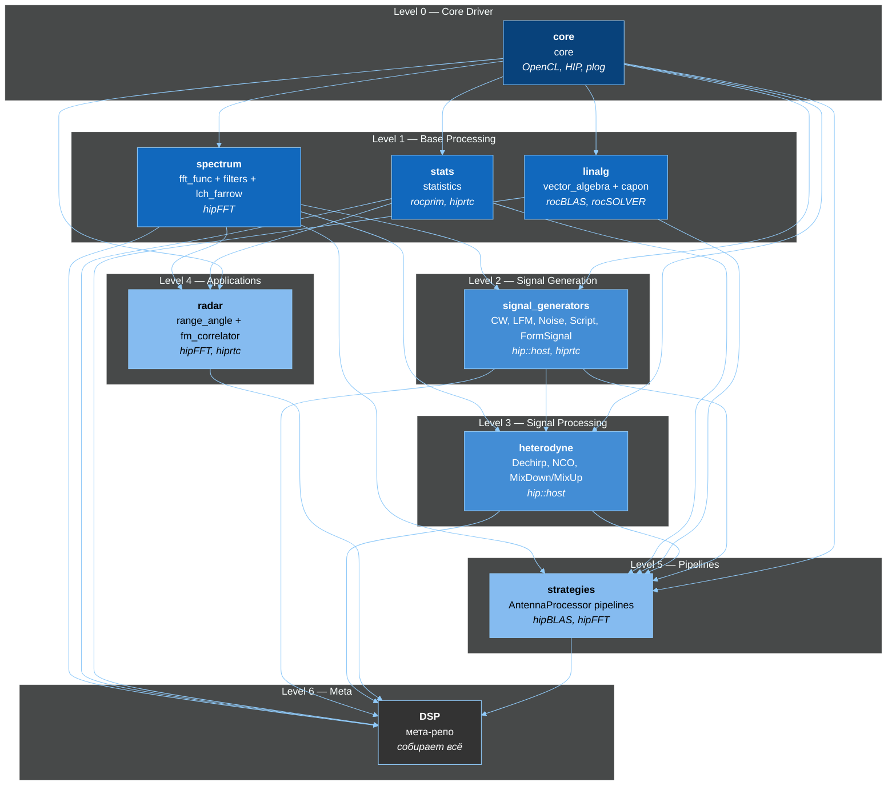

# DSP-GPU — Граф зависимостей

> **Источник**: автоматический анализ CMakeLists.txt + #include всех 12 модулей DSP-GPU
> **Дата**: 2026-04-12
> **Базовый проект**: DSP-GPU (E:\C++\DSP-GPU)

---

## 1. Граф зависимостей (будущий проект)



---

## 2. Таблица зависимостей

### Внутренние зависимости (модуль → модуль)

| Репо | Зависит от | Причина (из анализа кода) |
|------|-----------|--------------------------|
| **core** | — | Базовый драйвер, ни от кого не зависит |
| **spectrum** | core | fft_func, filters, lch_farrow используют core |
| **stats** | core | statistics использует core + GpuContext |
| **linalg** | core | vector_algebra + capon используют core + GpuContext |
| **signal_generators** | core, spectrum | `DelayedFormSignalGeneratorROCm` использует `lch_farrow` (из spectrum) |
| **heterodyne** | core, spectrum, signal_generators | `heterodyne_dechirp.cpp` импортирует `spectrum_processor_factory.hpp` из fft_func + использует signal_generators |
| **radar** | core, spectrum, stats | range_angle использует hipFFT (как spectrum), fm_correlator использует hipFFT. Stats для обработки |
| **strategies** | core, spectrum, stats, signal_generators, heterodyne, linalg | `antenna_processor_v1.cpp` импортирует: `statistics_processor.hpp` + `all_maxima_pipeline_rocm.hpp` из fft_func |
| **DSP** | все | Мета-репо, собирает всё |

### Внешние SDK

| SDK | Модули | Описание |
|-----|--------|----------|
| **OpenCL 3.0** | core | Baseline backend (только стыковка данных, НЕ вычисления) |
| **HIP / hip::host** | все кроме core | HIP runtime для AMD GPU |
| **hipFFT** | spectrum (fft_func), radar (fm_correlator, range_angle), strategies | Batched FFT на GPU |
| **hiprtc** | stats, linalg (optional), radar (optional) | Runtime kernel compilation |
| **rocprim** | stats | segmented_radix_sort для GPU median |
| **rocBLAS** | linalg (vector_algebra, capon), strategies | Dense BLAS (GEMM, etc.) |
| **rocSOLVER** | linalg (vector_algebra, capon) | Dense solver (Cholesky POTRF/POTRI) |
| **hipBLAS** | strategies | High-level BLAS |
| **plog** | core | Header-only logging |
| **hsa-runtime64** | core (optional) | Zero-copy HSA probe |

---

## 3. Маппинг: DSP-GPU modules → DSP-GPU repos

| DSP-GPU модуль | DSP-GPU репо | Уровень |
|-------------------|-------------|---------|
| `core/` | **core** | 0 |
| `modules/fft_func/` | **spectrum** | 1 |
| `modules/filters/` | **spectrum** | 1 |
| `modules/lch_farrow/` | **spectrum** | 1 |
| `modules/statistics/` | **stats** | 1 |
| `modules/vector_algebra/` | **linalg** | 1 |
| `modules/capon/` | **linalg** | 1 |
| `modules/signal_generators/` | **signal_generators** | 2 |
| `modules/heterodyne/` | **heterodyne** | 3 |
| `modules/range_angle/` | **radar** | 4 |
| `modules/fm_correlator/` | **radar** | 4 |
| `modules/strategies/` | **strategies** | 5 |
| `modules/test_utils/` | **core** (DspCore::TestUtils) | 0 |
| `Python_test/` | **DSP** (Python/) | 6 |
| `Doc/`, `Doc_Addition/` | **DSP** (Doc/) | 6 |
| `MemoryBank/` | **DSP** (MemoryBank/) | 6 |

---

## 4. Порядок сборки (Build Order)

Определяется уровнями графа — каждый уровень может собираться параллельно:

```
Шаг 1:  core                              ← ни от кого не зависит
Шаг 2:  spectrum, stats, linalg           ← зависят только от core (параллельно!)
Шаг 3:  signal_generators                 ← core + spectrum
Шаг 4:  heterodyne                        ← core + spectrum + signal_generators
Шаг 5:  radar                             ← core + spectrum + stats
Шаг 6:  strategies                        ← все предыдущие
Шаг 7:  DSP (мета-репо)                   ← собирает всё
```

---

## 5. Обнаруженные связи (из анализа кода DSP-GPU)

### Ключевые #include зависимости

| Файл | Импортирует | Обоснование |
|------|------------|-------------|
| `signal_generators/src/form_signal_generator_rocm.cpp` | `lch_farrow` headers | DelayedFormSignal использует Farrow-интерполяцию |
| `heterodyne/src/heterodyne_dechirp.cpp` | `fft_func/factory/spectrum_processor_factory.hpp` | Dechirp pipeline: signal → heterodyne → FFT |
| `strategies/src/antenna_processor_v1.cpp` | `statistics/statistics_processor.hpp` + `fft_func/all_maxima_pipeline_rocm.hpp` | Pipeline: GEMM → FFT → Statistics → MaximaSearch |
| `capon/src/capon_processor_rocm.cpp` | `vector_algebra/cholesky_inverter_rocm.hpp` | MVDR: covariance → Cholesky inversion → beamweights |

### fft_maxima — часть fft_func (НЕ отдельный модуль!)

`SpectrumMaximaFinder` / `AllMaximaPipelineROCm` живут в `modules/fft_func/` — это НЕ отдельный модуль, а часть spectrum.

### test_utils — header-only (нет CMakeLists.txt)

`modules/test_utils/` содержит `gpu_test_base.hpp`, `test_runner.hpp`, `validators/`. Нет CMakeLists.txt — подключается вручную через `#include`. В новой архитектуре → `DspCore::TestUtils` (INTERFACE target).

---

## 6. Проверки

- [x] Циклические зависимости: **НЕТ** (чистый DAG)
- [x] Все 12 модулей учтены
- [x] fft_maxima = часть fft_func (подтверждено)
- [x] test_utils = header-only (подтверждено)
- [x] OpenCL .cl kernels: НЕ переносим (только стыковка данных)
- [x] HIP kernels (*_kernels_rocm.hpp): переносим в `kernels/rocm/`
- [ ] **Ждёт обсуждения**: radar зависимость от spectrum (Alex: "должен использовать отлаженные библиотеки")
- [ ] **Ждёт обсуждения**: strategies → 5 модулей (сильная связность)

---

*Сгенерировано: 2026-04-12 автоматическим анализом DSP-GPU*
*Инструменты: Explore agent (37 tool calls) + sequential-thinking*
