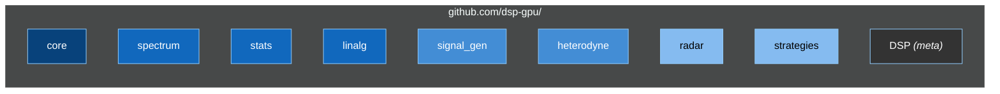

# DSP-GPU — Карта репозиториев

> **Дата**: 2026-04-12
> **Источник**: DSP-GPU (E:\C++\DSP-GPU)

---

## Обзор: 9 репозиториев



---

## Детали каждого репо

### core (Level 0)

| | |
|---|---|
| **GitHub** | `github.com/dsp-gpu/core` |
| **Источник** | `DSP-GPU/core/` + `modules/test_utils/` |
| **Содержимое** | Multi-backend GPU driver (OpenCL baseline + ROCm) |
| **CMake targets** | `DspCore::DspCore`, `DspCore::TestUtils` |
| **External SDK** | OpenCL, HIP, hiprtc (opt), plog, hsa-runtime64 (opt) |
| **Python module** | `dsp_core.pyd` |
| **Что внутри** | IBackend, GpuContext, GpuKernelOp, GPUProfiler, ConsoleOutput, BatchManager, KernelCacheService, configGPU.json |

---

### spectrum (Level 1)

| | |
|---|---|
| **GitHub** | `github.com/dsp-gpu/spectrum` |
| **Источник** | `modules/fft_func/` + `modules/filters/` + `modules/lch_farrow/` |
| **Содержимое** | FFT processing, FIR/IIR filters, Farrow interpolation, SpectrumMaxima |
| **CMake target** | `DspSpectrum::DspSpectrum` |
| **Depends** | `DspCore` |
| **External SDK** | hipFFT |
| **Python module** | `dsp_spectrum.pyd` |
| **Что внутри** | FFTProcessor, AllMaximaPipeline, FirFilter, IirFilter, KalmanFilter, KaufmanFilter, MovingAverage, LchFarrow |
| **Kernels** | 16 .cl (НЕ переносим) + 8 `*_kernels_rocm.hpp` (переносим в `kernels/rocm/`) |

---

### stats (Level 1)

| | |
|---|---|
| **GitHub** | `github.com/dsp-gpu/stats` |
| **Источник** | `modules/statistics/` |
| **Содержимое** | GPU statistics: mean, median, variance, std (welford_fused, radix sort) |
| **CMake target** | `DspStats::DspStats` |
| **Depends** | `DspCore` |
| **External SDK** | rocprim, hiprtc (opt) |
| **Python module** | `dsp_stats.pyd` |
| **Что внутри** | StatisticsProcessor (WelfordFused + ExtractMedians + RadixSort) |

---

### linalg (Level 1)

| | |
|---|---|
| **GitHub** | `github.com/dsp-gpu/linalg` |
| **Источник** | `modules/vector_algebra/` + `modules/capon/` |
| **Содержимое** | GPU linear algebra: Cholesky inversion, MVDR beamformer |
| **CMake target** | `DspLinalg::DspLinalg` |
| **Depends** | `DspCore` |
| **External SDK** | rocBLAS, rocSOLVER, hiprtc (opt) |
| **Python module** | `dsp_linalg.pyd` |
| **Что внутри** | CholeskyInverterROCm, SymmetrizeGPU, CaponProcessorROCm |

---

### signal_generators (Level 2)

| | |
|---|---|
| **GitHub** | `github.com/dsp-gpu/signal_generators` |
| **Источник** | `modules/signal_generators/` |
| **Содержимое** | GPU signal generation: CW, LFM, Noise, Script DSL, FormSignal |
| **CMake target** | `DspSignalGenerators::DspSignalGenerators` |
| **Depends** | `DspCore`, `DspSpectrum` (через lch_farrow для DelayedFormSignal) |
| **External SDK** | hip::host, hiprtc (ScriptGenerator) |
| **Python module** | `dsp_signal_generators.pyd` |
| **Что внутри** | CwGenerator, LfmGenerator, NoiseGenerator, ScriptGenerator, FormSignalGenerator, DelayedFormSignalGenerator |

---

### heterodyne (Level 3)

| | |
|---|---|
| **GitHub** | `github.com/dsp-gpu/heterodyne` |
| **Источник** | `modules/heterodyne/` |
| **Содержимое** | LFM Dechirp pipeline, NCO, frequency mixing |
| **CMake target** | `DspHeterodyne::DspHeterodyne` |
| **Depends** | `DspCore`, `DspSpectrum` (fft_func), `DspSignalGenerators` |
| **External SDK** | hip::host |
| **Python module** | `dsp_heterodyne.pyd` |
| **Что внутри** | HeterodyneDechirp, HeterodyneDechirpProcessorROCm (uses spectrum_processor_factory) |

---

### radar (Level 4)

| | |
|---|---|
| **GitHub** | `github.com/dsp-gpu/radar` |
| **Источник** | `modules/range_angle/` + `modules/fm_correlator/` |
| **Содержимое** | Range-angle processing, FM correlation |
| **CMake target** | `DspRadar::DspRadar` |
| **Depends** | `DspCore`, `DspSpectrum`, `DspStats` |
| **External SDK** | hipFFT, hiprtc (opt) |
| **Python module** | `dsp_radar.pyd` |
| **Что внутри** | RangeAngleProcessor (STUB — Ops are TODO), FmCorrelatorROCm |
| **Примечание** | range_angle пока заглушка, fm_correlator работает |

---

### strategies (Level 5)

| | |
|---|---|
| **GitHub** | `github.com/dsp-gpu/strategies` |
| **Источник** | `modules/strategies/` |
| **Содержимое** | Antenna array processor pipelines |
| **CMake target** | `DspStrategies::DspStrategies` |
| **Depends** | `DspCore`, `DspSpectrum`, `DspStats`, `DspSignalGenerators`, `DspHeterodyne`, `DspLinalg` |
| **External SDK** | hipBLAS, hipFFT |
| **Python module** | `dsp_strategies.pyd` |
| **Что внутри** | AntennaProcessorV1 (d_S → GEMM → Window+FFT → PostFFT → Statistics → MaximaSearch) |

---

### DSP (Level 6 — Meta)

| | |
|---|---|
| **GitHub** | `github.com/dsp-gpu/DSP` |
| **Источник** | DSP-GPU: Python_test/, Doc/, Doc_Addition/, MemoryBank/ |
| **Содержимое** | Мета-репо: CMake superbuild + Python тесты + документация |
| **Зависит от** | Все 8 репо выше |
| **Что внутри** | CMakeLists.txt (FetchContent all), CMakePresets.json, Python/ (тесты), Doc/ (документация), MemoryBank/ (управление) |

---

## Рабочие директории

```
E:\DSP-GPU\                          ← Windows (разработка)
├── DSP/                             ← мета-репо
├── core/                            ← core
├── spectrum/                        ← fft_func + filters + lch_farrow
├── stats/                           ← statistics
├── linalg/                          ← vector_algebra + capon
├── signal_generators/               ← signal generators
├── heterodyne/                      ← LFM dechirp
├── radar/                           ← range_angle + fm_correlator
└── strategies/                      ← antenna processor

.../C++/DSP-GPU/                     ← Debian (production + GPU тесты)
└── (та же структура)

Базовый проект (не трогаем!):
E:\C++\DSP-GPU\                   ← Windows
.../C++/DSP-GPU\                  ← Debian
```

---

*Сгенерировано: 2026-04-12*
