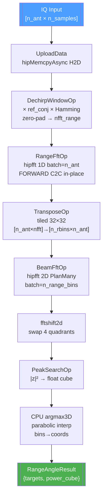

# RangeAngleProcessor — Полная документация

> 3D FFT обработка ЛЧМ-радара для 2D антенной решётки: дальность + азимут + элевация на GPU

**Namespace**: `range_angle`
**Каталог**: `modules/range_angle/`
**Backend**: ROCm only (`ENABLE_ROCM=1`, Linux + AMD GPU gfx1201+)
**Зависимости**: DrvGPU (`IBackend*`, `GpuContext`, `GpuKernelOp`), hipFFT, hiprtc

---

## Содержание

1. [Обзор и назначение](#1-обзор-и-назначение)
2. [Физика задачи — зачем 3D FFT](#2-физика-задачи)
3. [Математика алгоритма](#3-математика-алгоритма)
4. [Pipeline](#4-pipeline)
5. [Архитектура Ref03 (6 слоёв)](#5-архитектура-ref03)
6. [HIP Kernels](#6-hip-kernels)
7. [Operations — Layer 5](#7-operations-layer-5)
8. [Параметры RangeAngleParams](#8-параметры-rangeangleparams)
9. [Структуры данных](#9-структуры-данных)
10. [C++ API](#10-c-api)
11. [Python API](#11-python-api)
12. [Тесты](#12-тесты)
13. [Файловая структура](#13-файловая-структура)
14. [Важные нюансы](#14-важные-нюансы)
15. [Критерии приёмки (DoD)](#15-критерии-приёмки)
16. [Ссылки](#16-ссылки)

---

## 1. Обзор и назначение

`RangeAngleProcessor` — процессор для **определения дальности и угловых координат целей** в поле 2D антенной решётки (URA — Uniform Rectangular Array).

**Задача**: принять IQ-данные со всех антенн, обработать и вернуть трёхмерный куб мощности `[дальность × азимут × элевация]` и список найденных целей с координатами (R, θ_az, θ_el).

**Вход**: плоский вектор `complex<float>[n_ant × n_samples]` — antenna-major layout.

**Выход**: `RangeAngleResult` — 3D куб мощности + список `TargetInfo` (дальность в метрах, азимут и элевация в градусах, дробные бины, мощность в дБ).

### Параметры по умолчанию (реальная задача)

| Параметр | Значение |
|---------|---------|
| Антенная решётка | 16×16 = 256 антенн (URA) |
| Отсчётов на антенну | 1 300 000 |
| Полоса ЛЧМ (baseband) | 10 МГц (−5 МГц ... +5 МГц) |
| Частота дискретизации | 12 МГц |
| Несущая | 435 МГц (диапазон 430...440 МГц) |
| Шаг антенн | 0.345 м (λ/2 при 435 МГц) |

### Разрешающая способность

| Параметр | Формула | Значение |
|---------|---------|---------|
| По дальности ΔR | c / (2·B) | 15 м |
| По азимуту Δθ | arcsin(1/N_az) | ≈ 7.2° |
| По элевации Δθ | arcsin(1/N_el) | ≈ 7.2° |
| nfft_range (auto) | 2^⌈log₂(N)⌉ | 2^21 = 2 097 152 |
| Полезных range-бинов | nfft_range / 2 | 1 048 576 |

---

## 2. Физика задачи

### Проблема: дальность и угол в принятом сигнале

Радар излучает ЛЧМ-импульс (линейная частотная модуляция):

$$s_{tx}(t) = \exp\!\left(j\pi\mu t^2\right), \quad \mu = \frac{B}{T}, \quad t \in [0, T]$$

где B — полоса, T — длительность импульса. Принятый сигнал с цели на дальности R:

$$s_{rx}(t) = A \cdot s_{tx}(t - \tau), \quad \tau = \frac{2R}{c}$$

### Dechirp: превратить задержку в частоту

Умножение принятого сигнала на `conj(s_tx)` (stretch processing):

$$s_{beat}(t) = s_{rx}(t) \cdot s_{tx}^{*}(t) = A \cdot \exp\!\left(-j 2\pi \mu\tau \cdot t + j\pi\mu\tau^2\right)$$

Квадратичная фаза исчезает — остаётся чистый тон с частотой биений:

$$f_{beat} = \mu\tau = \frac{B}{T} \cdot \frac{2R}{c}$$

FFT даёт пик на частоте `f_beat`, из которой извлекается дальность:

$$R = \frac{f_{beat} \cdot c}{2\mu} = \frac{f_{beat} \cdot c \cdot T}{2B}$$

### Spatial FFT: угол из фазового сдвига

Антенна `k` (азимут) получает сигнал с дополнительным фазовым сдвигом:

$$\Delta\varphi_{az}(k) = 2\pi \frac{d}{\lambda} \sin\theta_{az} \cdot k$$

2D FFT по индексам антенн (после Range FFT + Transpose) даёт пик в угловом бине:

$$k_{az,peak} = \frac{N_{az} \cdot d}{\lambda} \sin\theta_{az}$$

Угол из бина (после fftshift, нулевой угол в центре):

$$\theta_{az} = \arcsin\!\left(\frac{(k_{az} - N_{az}/2) \cdot \lambda}{N_{az} \cdot d}\right)$$

---

## 3. Математика алгоритма

### Шаг 1: Dechirp + Hamming window

$$x_{dw}[a, i] = x_{rx}[a, i] \cdot \text{ref\_conj}[i] \cdot w[i], \quad i = 0 \ldots N_{fft}-1$$

где:
- `ref_conj[i] = exp(-jπμ(i/fs)²)` — генерируется на GPU ядром `gen_ref_kernel`
- `w[i] = 0.54 - 0.46·cos(2πi/(N-1))` — окно Хэмминга
- Для `i ≥ N_samples`: `x_dw[a,i] = 0` (zero-pad до `nfft_range`)

### Шаг 2: Range FFT (batch по антеннам)

$$X_R[a, k] = \text{FFT}_{N_{fft}}\{x_{dw}[a, \cdot]\}, \quad a = 0 \ldots N_{ant}-1$$

Используется `hipfftPlan1d` с `batch = n_ant`.

### Шаг 3: Transpose

$$X_T[k, a] = X_R[a, k]$$

Только первые `n_range_bins = nfft_range/2` колонок (one-sided spectrum).

### Шаг 4: 2D Beam FFT + fftshift

$$X_B[k, m_{az}, m_{el}] = \text{FFT2D}_{N_{az} \times N_{el}}\{X_T[k, m_{az}·N_{el} + m_{el}]\}$$

После FFT — 2D fftshift (свап 4 квадрантов), чтобы нулевой угол был в центре.

### Шаг 5: Power cube + Peak search

$$P[k, m_{az}, m_{el}] = |X_B[k, m_{az}, m_{el}]|^2$$

Argmax3D → параболическая интерполяция → физические координаты.

---

## 4. Pipeline

### ASCII диаграмма

```
[n_ant × n_samples] IQ-данные (CPU)
        │
        ▼ hipMemcpyAsync H2D
 shared_buf::kInput  [n_ant × n_samples]
        │
        ▼ dechirp_window_kernel  ×ref_conj × Hamming + zero-pad
 shared_buf::kDechirped  [n_ant × nfft_range]
        │
        ▼ hipfftPlan1d  batch=n_ant  HIPFFT_C2C FORWARD  (in-place)
        │
        ▼ transpose_complex_kernel  tiled 32×32  (только n_range_bins колонок)
 shared_buf::kTransposed  [n_range_bins × n_ant]
        │
        ▼ hipfftPlanMany rank=2 [16×16] batch=n_range_bins  HIPFFT_C2C FORWARD  (in-place)
        │
        ▼ fftshift2d_kernel  (swap 4 quadrants per range-bin)
        │
        ▼ magnitude_sq_kernel  |z|²  complex→float
 shared_buf::kPowerCube  [n_range_bins × n_az × n_el]  float32
        │
        ▼ hipStreamSynchronize + hipMemcpy D2H
  CPU: argmax3D → parabolic interp → (R_m, az_deg, el_deg)
        │
        ▼
 RangeAngleResult { targets[], power_cube[] }
```

### Mermaid диаграмма



---

## 5. Архитектура Ref03

Модуль реализует 6-слойную архитектуру Ref03:

| Слой | Класс | Файл | Назначение |
|------|-------|------|-----------|
| 1 | `GpuContext ctx_` | DrvGPU | per-module backend, stream, HIP module, 7 shared buffers |
| 2 | `IGpuOperation` | DrvGPU | интерфейс: `Name()`, `IsReady()`, `Release()` |
| 3 | `GpuKernelOp` | DrvGPU | base: доступ к скомпилированным kernels через `ctx_` |
| 4 | `BufferSet<N>` | DrvGPU | compile-time массив GPU-буферов |
| 5 | Concrete Ops | `operations/*.hpp` | `DechirpWindowOp`, `RangeFftOp`, `TransposeOp`, `BeamFftOp`, `PeakSearchOp` |
| 6 | `RangeAngleProcessor` | `include/range_angle_processor.hpp` | тонкий Facade, управляет жизненным циклом |

### Shared buffers (GpuContext, 7 слотов)

| Константа | Индекс | Размер | Содержание |
|-----------|--------|--------|-----------|
| `shared_buf::kInput` | 0 | n_ant × n_samples × 8B | Исходные IQ-данные |
| `shared_buf::kRef` | 1 | n_samples × 8B | conj(ref_lfm) |
| `shared_buf::kDechirped` | 2 | n_ant × nfft_range × 8B | После dechirp+window; in-place для Range FFT |
| `shared_buf::kRangeFFT` | 3 | — | alias kDechirped (in-place) |
| `shared_buf::kTransposed` | 4 | n_range_bins × n_ant × 8B | После transpose; in-place для Beam FFT |
| `shared_buf::kBeamFFT` | 5 | — | alias kTransposed (in-place) |
| `shared_buf::kPowerCube` | 6 | n_range_bins × n_az × n_el × 4B | Float power cube |

---

## 6. HIP Kernels

Все ядра компилируются через **hiprtc JIT** при первом вызове `EnsureCompiled()`.
Источник: `include/kernels/range_angle_kernels_rocm.hpp`.

### `hamming_window_kernel`
**Функция**: заполнить `float[n_samples]` окном Хэмминга.

```
w[i] = 0.54 - 0.46 * cos(2π·i / (N-1))
Grid: (⌈N/256⌉, 1, 1)   Block: (256, 1, 1)
```

**Оптимизации**: `__launch_bounds__(256)`, `__cosf` (fast intrinsic).

---

### `gen_ref_kernel`
**Функция**: сгенерировать сопряжённый ЛЧМ-опорный сигнал на GPU.

```
ref_conj[i] = exp(-jπμ·(i/fs)²),   μ = chirp_rate = B/T
Grid: (⌈N/256⌉, 1, 1)   Block: (256, 1, 1)
```

**Оптимизации**: `__cosf/__sinf`, `float2_t` struct (hiprtc не поддерживает `float2`).

---

### `dechirp_window_kernel`
**Функция**: dechirp + окно + zero-pad одновременно.

```
out[ant, i] = rx[ant,i] × ref_conj[i] × window[i],  i < n_samples
out[ant, i] = 0,                                      i >= n_samples
Grid: (⌈nfft_r/256⌉, n_ant, 1)   Block: (256, 1, 1)
```

**Оптимизации**: 2D grid (blockIdx.y = antenna) — нет деления/остатка, `__restrict__`.

---

### `transpose_complex_kernel`
**Функция**: тайловая транспозиция [n_rows × n_cols] → [n_cols × n_rows].

```
LDS tile[32][33]  — +1 padding против bank conflicts
Grid: (⌈n_cols/32⌉, ⌈n_rows/32⌉, 1)   Block: (32, 32, 1)
```

**Оптимизации**: LDS bank-conflict-free, коалесцентные чтение и запись.

---

### `fftshift2d_kernel`
**Функция**: 2D fftshift для каждого range-бина — свап 4 квадрантов.

```
Q1 ↔ Q4,  Q2 ↔ Q3  для каждого (range_bin, az/2, el/2)
Grid: (n_range_bins, n_az/2, n_el/2)   Block: (1, 1, 1)
```

**Оптимизации**: 3D grid — нет вычислений индексов, только swap.

---

### `magnitude_sq_kernel`
**Функция**: `|z|²` : `complex<float>` → `float` power cube.

```
out[i] = in[i].x² + in[i].y²
Grid: (⌈total/256⌉, 1, 1)   Block: (256, 1, 1)
```

**Оптимизации**: `__launch_bounds__(256)`, `__restrict__`.

---

## 7. Operations — Layer 5

### DechirpWindowOp
**Файл**: `include/operations/dechirp_window_op.hpp`

- `Initialize(GpuContext&)` — привязать контекст
- `InitWindow(uint32_t n_samples)` — выделить окно через `RequireShared`, запустить `hamming_window_kernel`
- `Execute(uint32_t n_ant, uint32_t n_samples, uint32_t nfft_r)` — `dechirp_window_kernel`

---

### RangeFftOp
**Файл**: `include/operations/range_fft_op.hpp`

- `InitPlan(uint32_t nfft_r, uint32_t batch)` — `hipfftPlan1d(HIPFFT_C2C, batch)` + `hipfftSetStream`
- `Execute()` — `hipfftExecC2C` in-place на `shared_buf::kDechirped`
- `OnRelease()` — `hipfftDestroy`

⚠️ **`hipfftSetStream` обязателен** — иначе FFT в default stream, гонки данных.

---

### TransposeOp
**Файл**: `include/operations/transpose_op.hpp`

- `Execute(uint32_t n_rows, uint32_t n_cols)` — `transpose_complex_kernel` via `hipModuleLaunchKernel`
- Grid: `dim3((n_cols+31)/32, (n_rows+31)/32)`, Block: `dim3(32,32)`

---

### BeamFftOp
**Файл**: `include/operations/beam_fft_op.hpp`

- `InitPlan(uint32_t n_az, uint32_t n_el, uint32_t n_range_bins)` — `hipfftPlanMany` rank=2, batch=n_range_bins + `hipfftSetStream`
- `Execute()` — `hipfftExecC2C` + `fftshift2d_kernel`
- `OnRelease()` — `hipfftDestroy`

---

### PeakSearchOp
**Файл**: `include/operations/peak_search_op.hpp`

`Execute(const RangeAngleParams& p, bool download)`:
1. `magnitude_sq_kernel` (GPU) — `kTransposed` → `kPowerCube`
2. `hipStreamSynchronize` + `hipMemcpy D2H`
3. CPU argmax3D — тройной цикл
4. Параболическая интерполяция по каждой оси:
   ```
   Δk = (v[k+1] - v[k-1]) / (2 * (2v[k] - v[k-1] - v[k+1]))
   ```
5. Бин → физические координаты:
   ```
   range_m  = r_frac × range_res_m
   sin_az   = (az_frac - N_az/2) / N_az × λ/d
   theta_az = arcsin(sin_az)
   ```

---

## 8. Параметры RangeAngleParams

**Файл**: `include/range_angle_params.hpp`

| Поле | Тип | Умолчание | Описание |
|------|-----|-----------|---------|
| `n_ant_az` | `uint32_t` | 16 | Антенн по азимуту |
| `n_ant_el` | `uint32_t` | 16 | Антенн по элевации |
| `n_samples` | `uint32_t` | 1 300 000 | Отсчётов на антенну |
| `f_start` | `float` | -5e6f | Начальная частота ЛЧМ (baseband), Гц |
| `f_end` | `float` | +5e6f | Конечная частота ЛЧМ (baseband), Гц |
| `sample_rate` | `float` | 12e6f | Частота дискретизации, Гц |
| `nfft_range` | `uint32_t` | 0 (auto) | 0 → авто: следующая 2^n ≥ n_samples |
| `antenna_spacing` | `float` | 0.345f | Расстояние между антеннами, м (λ/2 при 435 МГц) |
| `carrier_freq` | `float` | 435e6f | Несущая частота, Гц |
| `peak_mode` | `PeakSearchMode` | TOP_1 | Режим поиска пиков |
| `n_peaks` | `uint32_t` | 1 | Максимальное число пиков (TOP_N) |

### Вычисляемые поля (заполняются в `SetParams → ComputeDerivedParams`)

| Поле | Формула | Пример |
|------|---------|--------|
| `n_range_bins` | `nfft_range / 2` | 1 048 576 |
| `range_res_m` | `c / (2·B)` | 15 м |

### Вспомогательные методы

```cpp
uint32_t GetNAntennas()  const { return n_ant_az * n_ant_el; }   // 256
float    GetBandwidth()  const { return f_end - f_start; }        // 10e6
float    GetDuration()   const { return n_samples / sample_rate; }
float    GetChirpRate()  const { return GetBandwidth() / GetDuration(); }
```

---

## 9. Структуры данных

### PeakSearchMode (enum)

```cpp
enum class PeakSearchMode {
  TOP_1,  // Один глобальный максимум
  TOP_N,  // До n_peaks пиков по порогу (TODO)
};
```

### TargetInfo

```cpp
struct TargetInfo {
  float range_m;       // Дальность, метры
  float angle_az_deg;  // Азимут, градусы (±53.1° при d=λ/2, N=16)
  float angle_el_deg;  // Элевация, градусы
  float range_bin;     // Дробный дальностный бин (после параболы)
  float az_bin;        // Дробный азимутальный бин
  float el_bin;        // Дробный элевационный бин
  float power_db;      // Мощность в дБ (10·log10(|z|²_peak))
  float snr_db;        // SNR в дБ (не вычислен = 0)
};
```

### RangeAngleResult

```cpp
struct RangeAngleResult {
  bool                    success = false;
  uint32_t                n_range_bins = 0;
  uint32_t                n_ant_az = 0;
  uint32_t                n_ant_el = 0;
  std::vector<float>      power_cube;        // [n_range_bins × n_az × n_el] float32
                                              // заполняется только при download_result=true
  void*                   gpu_power_cube = nullptr;  // GPU-указатель на kPowerCube
  std::vector<TargetInfo> targets;
  std::string             error_message;
};
```

---

## 10. C++ API

### Минимальный пример

```cpp
#include "range_angle/include/range_angle_processor.hpp"

range_angle::RangeAngleParams p;
p.n_ant_az = 16; p.n_ant_el = 16; p.n_samples = 1'300'000;
// f_start, f_end, sample_rate, carrier_freq, antenna_spacing — умолчания

range_angle::RangeAngleProcessor proc(backend);  // IBackend*
proc.SetParams(p);

std::vector<std::complex<float>> iq(p.GetNAntennas() * p.n_samples);
// ... заполнить данными антенной решётки ...

auto result = proc.Process(iq);  // download_result = true по умолчанию

if (result.success) {
    auto& tgt = result.targets[0];
    con.Print(gpu_id, "Main",
        "R=" + std::to_string(tgt.range_m) + "m"
        " az=" + std::to_string(tgt.angle_az_deg) + "deg"
        " el=" + std::to_string(tgt.angle_el_deg) + "deg");
}
```

### Пример с профилированием

```cpp
drv_gpu_lib::GPUProfiler profiler;
// ⚠️ SetGPUInfo ОБЯЗАТЕЛЕН перед Start()!
profiler.SetGPUInfo(
    backend->GetDeviceIndex(),
    backend->GetDeviceName(),
    backend->GetDriverVersion());
profiler.Start();

for (int i = 0; i < 5; i++) {
    profiler.Mark("Process_" + std::to_string(i));
    proc.Process(iq, /*download_result=*/false);
}

profiler.Stop();
profiler.PrintReport();
profiler.ExportJSON("Results/Profiler/range_angle_benchmark.json");
```

### Benchmark — без D2H

```cpp
// download_result=false — не копировать куб на CPU (экономия ~десятков мс)
auto result = proc.Process(iq, false);
// result.gpu_power_cube — валидный GPU-указатель (shared_buf::kPowerCube)
```

---

## 11. Python API

### Установка

```bash
cmake .. -DENABLE_ROCM=ON -DBUILD_PYTHON=ON -DCMAKE_PREFIX_PATH=/opt/rocm
cmake --build build -- python_bindings
export PYTHONPATH=build/python
```

### Базовый пример

```python
import numpy as np
import gpu_worklib as gw

ctx = gw.ROCmGPUContext(0)

p = gw.RangeAngleParams()
p.n_ant_az = 8; p.n_ant_el = 8; p.n_samples = 50_000
p.f_start = -5e6; p.f_end = 5e6; p.sample_rate = 12e6

proc = gw.RangeAngleProcessor(ctx)
proc.set_params(p)

n_ant = p.get_n_antennas()  # 64
iq = np.random.randn(n_ant * 50_000).astype(np.float32) + \
     1j * np.random.randn(n_ant * 50_000).astype(np.float32)

result = proc.process(iq.astype(np.complex64), download_result=True)

if result.success:
    for tgt in result.targets:
        print(f"R={tgt.range_m:.0f}m  az={tgt.angle_az_deg:.1f}°  el={tgt.angle_el_deg:.1f}°")

# 3D куб как numpy array [n_range_bins, n_az, n_el]
cube = result.power_cube_numpy()
print(f"Cube shape: {cube.shape}")  # (nfft/2, 8, 8)
```

### Визуализация среза Range-Angle

```python
import matplotlib.pyplot as plt

cube = result.power_cube_numpy()  # [n_rbins, n_az, n_el]
el_center = cube.shape[2] // 2
ra_slice = 10 * np.log10(cube[:, :, el_center] + 1e-10)  # dB

plt.figure(figsize=(12, 5))
params = proc.get_params()
R_max = cube.shape[0] * params.range_res_m / 1000  # км
plt.imshow(ra_slice.T, aspect='auto', origin='lower',
           extent=[0, R_max, -90, 90])
plt.xlabel('Дальность, км'); plt.ylabel('Азимут, °')
plt.colorbar(label='Мощность, дБ')
plt.savefig('Results/Plots/range_angle/range_az_slice.png', dpi=150)
```

---

## 12. Тесты

### Таблица тестов

| # | Функция | Файл | Тип |
|---|---------|------|-----|
| T1 | `TestRangeAngleBasic` | `test_range_angle_basic.hpp` | Функциональный |
| T2 | `TestRangeAngleBenchmark` | `test_range_angle_benchmark.hpp` | Профилирование |

### T1: TestRangeAngleBasic

**Входные данные**: синтетический ЛЧМ задержанный на τ = 0.5 мс, 8×8 антенн, 50 000 отсчётов. Все антенны получают одинаковый сигнал (цель строго спереди, угол 0°).

**Почему такие данные**: малые размеры (8×8, 50K) → тест завершается за секунды; τ = 0.5 мс → известная дальность R = c·τ/2 = 75 000 м; одинаковый сигнал на всех антеннах → пик в угловом бине ровно по центру (0°).

**Ожидаемый результат**:
- `result.success == true`
- `|result.targets[0].range_m - 75000| < 500 м`

**Какой баг ловит**: некорректный dechirp (неверная формула умножения), неверный `ComputeDerivedParams` (неправильный `n_range_bins`), ошибка пересчёта бин→дальность, отсутствие `SetParams`.

**Почему порог 500 м**: при 50K отсчётов и B=10 МГц разрешение грубее расчётного (реальный bin=15 м при полном N=1.3M), 500 м — консервативная приёмочная граница.

---

### T2: TestRangeAngleBenchmark

**Входные данные**: плоский комплексный массив 8×8 × 50 000. 3 итерации `Process(download=false)`.

**Ожидаемый результат**: GPUProfiler печатает таймингиэтапов, JSON сохраняется в `Results/Profiler/`.

**Какой баг ловит**: утечки GPU-памяти при повторных вызовах, deadlock stream после повторного `SetParams`, отсутствие `SetGPUInfo` (Unknown в отчёте).

---

## 13. Файловая структура

```
modules/range_angle/
├── CMakeLists.txt
├── include/
│   ├── range_angle_processor.hpp         ← Facade (Layer 6)
│   ├── range_angle_params.hpp            ← RangeAngleParams
│   ├── range_angle_types.hpp             ← PeakSearchMode, TargetInfo, RangeAngleResult, shared_buf
│   ├── kernels/
│   │   └── range_angle_kernels_rocm.hpp  ← HIP kernel sources (hiprtc JIT)
│   └── operations/
│       ├── dechirp_window_op.hpp         ← Layer 5
│       ├── range_fft_op.hpp              ← Layer 5
│       ├── transpose_op.hpp              ← Layer 5
│       ├── beam_fft_op.hpp               ← Layer 5
│       └── peak_search_op.hpp            ← Layer 5
├── src/
│   ├── range_angle_processor.cpp
│   ├── dechirp_window_kernel.hip         ← placeholder (kernels в .hpp)
│   ├── transpose_kernel.hip              ← placeholder
│   └── fftshift2d_kernel.hip             ← placeholder
└── tests/
    ├── all_test.hpp
    ├── test_range_angle_basic.hpp
    ├── test_range_angle_benchmark.hpp
    └── README.md

python/py_range_angle_rocm.hpp            ← pybind11 биндинг
Python_test/range_angle/
  └── test_range_angle.py                 ← тесты
Doc/Modules/range_angle/                  ← документация
  ├── Full.md  ← этот файл
  ├── Quick.md
  └── API.md
```

---

## 14. Важные нюансы

### `hipfftSetStream` — обязателен для обоих планов

```cpp
hipfftSetStream(plan_, ctx_.stream());  // ВСЕГДА после hipfftPlan*
```

Без этого FFT работает в default stream → гонки данных с dechirp/transpose.

### Zero-pad внутри dechirp kernel

`dechirp_window_kernel` сам пишет `0` для `i >= n_samples`. Отдельный `hipMemset` не нужен.

### Один `hipStreamSynchronize` в конце

Все операции выполняются в `ctx_.stream()`. Синхронизация — только в `PeakSearchOp::Execute` перед D2H (требуется для CPU argmax).

### hiprtc: `float2_t` вместо `float2`

Hiprtc не предоставляет `float2` из hip_runtime.h. В kernel source используется локальный `struct float2_t { float x; float y; }`.

### `SetGPUInfo` перед `Start()`

```cpp
// ⚠️ ПОРЯДОК ВАЖЕН!
profiler.SetGPUInfo(backend->GetDeviceIndex(),
                    backend->GetDeviceName(),
                    backend->GetDriverVersion());
profiler.Start();  // ТОЛЬКО после SetGPUInfo!
```

### Консоль — только 3 аргумента

```cpp
con.Print(gpu_id, "RangeAngle", "message");  // ✅
std::cout << "message";                       // ❌ запрещено
```

### Вывод профилирования — только через PrintReport/Export

```cpp
profiler.PrintReport();                                    // ✅
profiler.ExportJSON("Results/Profiler/range_angle.json");  // ✅
// ❌ GetStats() + цикл — запрещено
```

---

## 15. Критерии приёмки (DoD)

```
[ ] cmake .. -DENABLE_ROCM=ON && make -j8  — без ошибок
[ ] ./GPUWorkLib range_angle — TestRangeAngleBasic PASS
[ ] Дальность: погрешность < 1 бин (15 м) на эталонных данных
[ ] Углы: погрешность < 1 бин (7.2°) или < 0.5° с параболой
[ ] GPUProfiler отчёт сохранён: Results/Profiler/range_angle_benchmark.json
[ ] Python тест: python run_tests.py -m range_angle/ PASSED
[ ] Графики: Results/Plots/range_angle/
[ ] Большой тест (16×16 × 1.3M) — выполняется без OOM
```

---

## 16. Ссылки

**Архитектура**:
- [Ref03 Unified Architecture](../../Doc_Addition/PLAN/Ref03_Unified_Architecture.md)
- [ROCm/HIP Optimization Guide](../../Doc_Addition/Info_ROCm_HIP_Optimization_Guide.md)
- [GPUProfiler SetGPUInfo](../../Examples/GPUProfiler_SetGPUInfo.md)

**Смежные модули**:
- [Heterodyne](../heterodyne/Full.md) — одноантенный dechirp (упрощённый аналог Range FFT)
- [Statistics](../statistics/Full.md) — образец Ref03 Op архитектуры
- [FFT Func](../fft_func/Full.md) — использование hipFFT в GPUWorkLib

**API этого модуля**:
- [API.md](API.md) — справочник всех классов и методов
- [Quick.md](Quick.md) — шпаргалка
