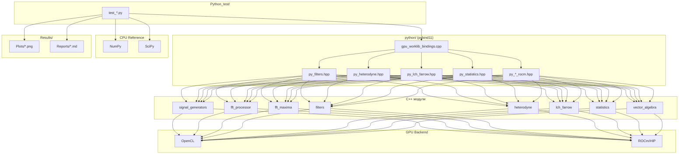

# Python_test — Полная документация

> Тестовая инфраструктура GPUWorkLib: Python-тесты для всех GPU-модулей

**Каталог**: `Python_test/`
**Фреймворк**: TestRunner (common/runner.py)
**Зависимости**: pybind11, numpy, scipy (опционально), matplotlib (опционально), gpuworklib (C++ модуль)
**Архитектура**: OOP/SOLID/GRASP/GoF — рефакторинг 2026-03-08

---

## Содержание

1. [Обзор и назначение](#1-обзор-и-назначение)
2. [Архитектура тестовой инфраструктуры](#2-архитектура)
3. [Сборка и настройка](#3-сборка-и-настройка)
4. [Покрытие модулей](#4-покрытие-модулей)
5. [Детальное описание тестов по модулям](#5-детальное-описание-тестов)
6. [Паттерны и соглашения](#6-паттерны-и-соглашения)
7. [Запуск тестов](#7-запуск-тестов)
8. [Выходные артефакты](#8-выходные-артефакты)
9. [Python Bindings (pybind11)](#9-python-bindings)
10. [Python API документация](#10-python-api-документация)
11. [C4 Диаграммы](#11-c4-диаграммы)
12. [Файловое дерево](#12-файловое-дерево)
13. [Важные нюансы](#13-важные-нюансы)

---

## 1. Обзор и назначение

`Python_test/` — единая точка входа для Python-тестирования всех GPU-модулей GPUWorkLib. Каждый подкаталог соответствует одному модулю C++ и содержит тесты с визуализацией результатов.

**Назначение**:
- **Валидация корректности**: GPU vs CPU-эталон (NumPy/SciPy)
- **Регрессионное тестирование**: проверка при изменениях C++ кода
- **Визуализация**: автогенерация графиков в `Results/Plots/`
- **Документация через тесты**: каждый тест демонстрирует правильное использование API

**Связь с C++ тестами**:
- C++ тесты (`modules/*/tests/*.hpp`) проверяют низкоуровневую корректность kernel'ов
- Python тесты проверяют **end-to-end** через pybind11: от входных данных до результата
- Python тесты генерируют **графики** для визуальной верификации

---

## 2. Архитектура

### 2.1 Общая схема тестирования

```
Python test script (test_*.py)
    │
    ├── conftest.py fixtures ──┐
    │   (gw, gpu_ctx, rng)     │
    │                          ▼
    │                    ┌─────────────────┐
    │                    │  common/         │
    │                    │  GPULoader       │  ←── Singleton: находит .so
    │                    │  GPUContextMgr   │  ←── Singleton: хранит ctx
    │                    │  TestBase        │  ←── Template Method
    │                    │  IValidator      │  ←── Strategy
    │                    │  IReporter       │  ←── Observer
    │                    └────────┬─────────┘
    │                             │
    ├── import gpuworklib  ←──────┘  pybind11 (.pyd / .so)
    │       │                         │
    │       │                    C++ модули (DrvGPU, FFT, Filters...)
    │       │                         │
    │       │                    OpenCL / ROCm (GPU)
    │       │
    ├── import numpy/scipy  ←── CPU эталон
    │
    ├── GPU result vs CPU reference  → ValidationResult
    │
    └── [demo_*.py] matplotlib plots → Results/Plots/{module}/
        (НЕ в тестах — разделение слоёв)
```

### 2.2 Слои тестирования

| Слой | Файлы | Требования | Запуск |
|------|-------|-----------|--------|
| **тесты** | `test_*.py` | numpy, gpuworklib (skip если нет) | `python run_tests.py -v` |
| **демо-скрипты** | `demo_*.py`, `example_*.py` | + matplotlib, опционально AI | `python demo_ai_pipeline.py` |

**Ключевое правило**: `test_*.py` никогда не импортируют matplotlib напрямую.

### 2.3 OOP/SOLID архитектура (GoF + GRASP)

| Паттерн | Класс | Назначение |
|---------|-------|-----------|
| **Singleton** | `GPULoader`, `GPUContextManager` | Один .so и один ctx на сессию |
| **Template Method** | `TestBase.run()`, `PipelineBase.run()` | Скелет теста/pipeline |
| **Strategy** | `IValidator`, `IPlotter`, `LLMParser` | Взаимозаменяемые реализации |
| **Observer** | `IReporter` | Console/JSON отчёты |
| **Builder** | `ScenarioBuilder` | Fluent API для сценариев |
| **Factory Method** | `conftest.py` fixtures | Создание объектов для тестов |

**SOLID**:
- **SRP**: `FilterDesigner` только считает коэффициенты, `LLMParser` только парсит NL, `IPlotter` только рисует
- **OCP**: новый LLM-бэкенд = новый подкласс `LLMParser` без изменения кода
- **DIP**: все тесты получают `gpuworklib` через `GPULoader.get()`, не хардкодят путь
- **ISP**: мелкие dataclass (`SignalConfig`, `FilterConfig`) вместо одного большого dict

### 2.4 Mermaid-диаграмма

### Mermaid-диаграмма (полный граф модулей)



---

## 3. Сборка и настройка

### 3.1 Сборка gpuworklib (pybind11)

**OpenCL backend** (Windows/Linux, NVIDIA/Intel/AMD):
```bash
cd GPUWorkLib
cmake -B build -DBUILD_PYTHON=ON
cmake --build build --config Release
# Результат: build/python/Release/gpuworklib.cp312-win_amd64.pyd (Windows)
#             build/python/gpuworklib.cpython-312-x86_64-linux-gnu.so (Linux)
```

**ROCm backend** (Linux + AMD GPU):
```bash
cmake -B build/rocm -DBUILD_PYTHON=ON -DENABLE_ROCM=ON -DCMAKE_PREFIX_PATH=/opt/rocm
cmake --build build/rocm
# Результат: build/rocm/python/gpuworklib.cpython-*.so
```

### 3.2 Зависимости Python

| Пакет | Обязательный | Назначение |
|-------|-------------|------------|
| `numpy` | ✅ Да | Массивы, CPU-эталон |
| `pybind11` | ✅ Да (build) | C++ → Python биндинги |
| `scipy` | ⚠️ Рекомендуется | Фильтры (firwin, sosfilt), find_peaks |
| `matplotlib` | ⚠️ Рекомендуется | Графики (Agg backend для CI) |
| `pytest` | ❌ Не используется | Заменён на TestRunner |
| `groq` / `ollama` | ❌ Опционально | AI-pipeline для фильтров |

> ⚠️ Файла `requirements.txt` в проекте нет. Зависимости указаны в docstrings каждого теста.

### 3.3 Настройка PyCharm

1. **Working directory**: корень `GPUWorkLib/` (где `Python_test/` и `build/`)
2. **PYTHONPATH**: добавить `$ProjectFileDir$/build/python` (или `.../Release`)
3. **Environment**: `GPUWORKLIB_PLOT=1` (опционально, по умолчанию включено)

### 3.4 Автодетекция пути к сборке

#### Новый способ (рекомендуется): GPULoader Singleton

Все новые тесты используют `GPULoader` из `common/gpu_loader.py`:

```python
# Через GPUContextManager:
def test_something(gpu_ctx):   # fixture из conftest.py → skip если нет GPU
    f = gpuworklib.FirFilterROCm(gpu_ctx, coeffs)

# Напрямую:
from common.gpu_loader import GPULoader
gw = GPULoader.get()   # None если не найден, иначе модуль gpuworklib
if gw is None:
    raise SkipTest("gpuworklib not found")
ctx = gw.GPUContext(0)
```

**Порядок поиска** (от приоритетного):
1. `build/python/Release` — MSVC Release
2. `build/python/Debug` — MSVC Debug
3. `build/debian-radeon9070/python` — Linux ROCm
4. `build/Release` — альтернатива
5. `build/Debug`
6. `build/python` — общая сборка

#### Старый способ (обратная совместимость): ручной поиск в файле

Старые тесты (`test_form_signal.py`, `test_heterodyne_step_by_step.py` и др.) сохраняют прежний паттерн — они работают без изменений:

```python
BUILD_PATHS = [
    os.path.join(os.path.dirname(__file__), '..', '..', 'build', 'python', 'Debug'),
    os.path.join(os.path.dirname(__file__), '..', '..', 'build', 'python', 'Release'),
    os.path.join(os.path.dirname(__file__), '..', '..', 'build', 'debian-radeon9070', 'python'),
]
for p in BUILD_PATHS:
    if os.path.isdir(p):
        sys.path.insert(0, os.path.abspath(p))
        break
```

---

## 4. Покрытие модулей

### Сводная таблица

| Модуль | Каталог | Файлов | OpenCL | ROCm | GPU vs CPU | conftest | Графики |
|--------|---------|--------|--------|------|------------|----------|---------|
| **common** | `common/` | 10 | — | — | (инфраструктура) | — | — |
| **signal_generators** | `signal_generators/` | 4+2 | ✅ | ✅ | NumPy getX | ✅ | ✅ 3 папки |
| **filters** | `filters/` | 5+3+4 | ✅ | ✅ | SciPy lfilter/sosfilt | ✅ | ✅ |
| **heterodyne** | `heterodyne/` | 4+2 | ✅ | ✅ | NumPy FFT | ✅ | ✅ |
| **fft_maxima** | `fft_maxima/` | 3+1 | ✅ | ✅* | SciPy find_peaks | ✅ | ✅ |
| **lch_farrow** | `lch_farrow/` | 2+1 | ✅ | ✅ | CPU Lagrange | ✅ | ✅ |
| **statistics** | `statistics/` | 1+1 | — | ✅ | NumPy mean/median | ✅ | — |
| **vector_algebra** | `vector_algebra/` | 2+1 | — | ✅ | NumPy linalg + CSV | ✅ | Markdown |
| **integration** | `integration/` | 3+1 | ✅ | — | Combined | ✅ | ✅ |
| **strategies** | `strategies/` | 5+1 | — | — | numpy | ✅ | — |
| **hybrid** | `hybrid/` | 1 | ✅ | ✅ | — | — | — |
| **zero_copy** | `zero_copy/` | 1 | ✅ | ✅ | — | — | — |

Формат "N+M": N = тестовых файлов, M = инфраструктурных (conftest, *_base, ai_pipeline)
\* fft_maxima ROCm: indirect validation через HeterodyneDechirp (hipFFT)

**Итого: 11 подкаталогов + common/, 57 файлов (было 36: +30 инфраструктурных)**

---

## 5. Детальное описание тестов

### 5.1 signal_generators/

#### test_form_signal.py — FormSignalGenerator

Тестирует GPU-генерацию сигналов по формуле `getX` с различными параметрами.

| # | Функция | Входные данные | Ожидаемый результат | Что ловит | Порог |
|---|---------|----------------|---------------------|-----------|-------|
| 1 | `test_cw_no_noise` | CW: f0=1000 Hz, A=1.0, 8 каналов, N=4096 | Re/Im = A·cos/sin(2πf0·t) — совпадение с NumPy | Базовую генерацию CW на GPU, ошибки в формуле getX | max_error < 1e-3 |
| 2 | `test_chirp_signal` | LFM: f0=500, fdev=2000, tau=100 мкс | Спектр расширен на fdev, фаза квадратичная | Chirp генерацию, линейность частоты | max_error < 1e-3 |
| 3 | `test_window_function` | CW + окно Хэмминга | Амплитуда модулирована окном (0 на краях) | Применение оконной функции в kernel | max_error < 1e-3 |
| 4 | `test_multichannel` | 8 каналов, разные f0 | Каждый канал — независимый тон | Изоляцию каналов, broadcast параметров | max_error < 1e-3 |
| 5 | `test_noise_generation` | Шум: noise_power указан | Мощность шума ≈ noise_power (±50%) | PRNG корректность на GPU (Philox + Box-Muller) | ratio 0.5–2.0 |
| 6 | `test_string_params` | Строковые параметры "CW f0=1000" | Парсинг строки → корректный сигнал | String DSL parser | max_error < 1e-3 |
| 7 | `test_signal_plus_noise` | CW + белый шум | Сигнал+шум, SNR > 10 dB | Суммирование signal+noise в GPU | SNR check |

**Почему выбраны именно эти входные данные**: CW — простейший детерминистический сигнал, ошибки сразу видны. Chirp — основной рабочий сигнал ЛЧМ-радара. Мультиканал — типичный сценарий ФАР. Шум — проверка GPU-PRNG (Philox), который может давать артефакты при неправильной инициализации seed.

**Графики**: `Results/Plots/signal_generators/FormSignal/`

---

#### test_delayed_form_signal.py — DelayedFormSignalGenerator (Farrow 48×5)

Тестирует генерацию сигнала с дробной задержкой через интерполяцию Лагранжа (матрица 48×5).

| # | Функция | Входные данные | Ожидаемый результат | Что ловит | Порог |
|---|---------|----------------|---------------------|-----------|-------|
| 1 | `test_integer_delay` | CW, delay=5 samples (целое) | Сигнал сдвинут ровно на 5 отсчётов | Базовую задержку без интерполяции; если ошибка — сломан shift | max_error < 1e-2 |
| 2 | `test_fractional_delay` | CW, delay=2.7 samples (дробное) | GPU (Lagrange 48×5) ≈ NumPy Lagrange | Интерполяцию Лагранжа: правильный выбор row из таблицы 48×5 по frac-части | max_error < 1e-2 |
| 3 | `test_multichannel_delay` | 8 антенн, delays=[0, 1.5, ..., 10.5] мкс | Каждый канал задержан правильно | Мультиканальную задержку, broadcast матрицы Лагранжа | max_error < 1.0 (ослаблен — известная разница ~0.5) |
| 4 | `test_zero_delay` | delay=0 | Совпадение с FormSignalGenerator (без задержки) | Граничный случай: при τ=0 Farrow не должен портить сигнал | max_error < 1e-4 |
| 5 | `test_delay_with_noise` | CW + noise, delay=3 samples | Мощность шума ≈ expected | Шум не разрушается интерполяцией, PRNG стабилен | ratio 0.5–2.0 |

**Почему порог теста 3 ослаблен (1.0)**: Farrow 48×5 для коротких сигналов на краях может давать ошибку ~0.5 из-за граничных эффектов. Это известное ограничение, помечено TODO в коде.

**Алгоритм дробной задержки (Lagrange 48×5)**:
```
read_pos(n) = n - delay_samples
center = floor(read_pos)
frac = read_pos - center
row = int(frac * 48) % 48
output[n] = Σ L[row][k] · input[center-1+k],  k=0..4
```

Матрица L хранится в `lagrange_matrix_48x5.json` — 48 строк × 5 столбцов.

**Графики**: `Results/Plots/signal_generators/DelayedFormSignal/`
- `plot1_integer_delay.png` — целая задержка, GPU vs NumPy
- `plot2_fractional_delay.png` — дробная задержка, overlay
- `plot3_multichannel_waterfall.png` — мультиканал, waterfall
- `plot4_delay_sweep.png` — ошибка vs задержка (sweep)

---

#### test_lfm_analytical_delay.py — LfmAnalyticalDelay

Тестирует аналитическую генерацию ЛЧМ с задержкой (формула S(t−τ), без Farrow/Lagrange).

| # | Функция | Входные данные | Ожидаемый результат | Что ловит | Порог |
|---|---------|----------------|---------------------|-----------|-------|
| 1 | `test_zero_delay` | delay=0 | Совпадение с LFM без задержки | Граничный случай: генератор не портит сигнал при τ=0 | max_error < 1e-4 |
| 2 | `test_fractional_delay` | delay=3.24 samples | s(t−τ): нули до index 4, фаза сдвинута | Корректность подстановки (t−τ) в квадратичную фазу; ошибка знака → полностью неправильный сигнал | max_error < 1e-3 |
| 3 | `test_gpu_vs_cpu` | float32 GPU vs float64 CPU | max_error < 1e-3 | Ошибки точности float32 (квадратичная фаза может накапливать) | max_error < 1e-3 |
| 4 | `test_multi_antenna` | 5 антенн, delays=[0, 50, 100, 150, 200] мкс | Каждая антенна — свой delay | Мультиканальность: broadcast параметров f_start/f_end, индивидуальные τ | max_error < 1e-3 |
| 5 | `test_vs_numpy` | GPU result vs NumPy reference | Поэлементное совпадение | End-to-end сравнение: float32 GPU vs float64 NumPy | max_error < 1e-3 |

**Почему аналитическая задержка**: в отличие от Farrow (интерполяция по таблице), аналитическая подстановка S(t−τ) даёт точный результат без артефактов. Используется как **эталон** для верификации других методов задержки.

**Графики**: `Results/Plots/signal_generators/LfmAnalyticalDelay/`
- `plot1_real_delay_overlay.png` — Original vs Delayed
- `plot2_fractional_delay_boundary.png` — дробная задержка 3.24 sample
- `plot3_multiantenna_delays.png` — Multi-antenna с разными задержками

---

#### example_form_signal.py — Демонстрационный скрипт

Не тест (нет assert). Демонстрирует:
- Формулу `getX` для FormSignalGenerator
- Сравнение FormSignalGenerator и FormScriptGenerator
- Генерацию графиков для презентаций

---

### 5.2 filters/

#### test_filters_stage1.py — FIR/IIR OpenCL pipeline

Полный пайплайн: SciPy-дизайн коэффициентов → GPU-фильтрация → сравнение с SciPy reference.

| # | Тест | Входные данные | Ожидаемый результат | Что ловит | Порог |
|---|------|----------------|---------------------|-----------|-------|
| 1 | FIR lowpass | Sin(1 kHz) + Sin(10 kHz), fs=50 kHz, 64-tap LP | Высокочастотная составляющая подавлена; GPU ≈ `scipy.signal.lfilter` | Корректность свёртки на GPU (FIR kernel) | max_error < 1e-3 |
| 2 | FIR highpass | То же, HP фильтр | Низкочастотная подавлена | HP-режим, инверсия коэффициентов | max_error < 1e-3 |
| 3 | FIR bandpass | Multi-tone, BP фильтр | Только полоса пропускания | Корректность bandpass, нет aliasing | max_error < 1e-3 |
| 4 | IIR lowpass | Sin + noise, order=8 Butterworth | `scipy.signal.sosfilt` ≈ GPU biquad cascade | Рекурсивный фильтр на GPU (biquad sections), стабильность | max_error < 1e-2 |
| 5 | IIR stability | Длинный сигнал (N=32768) | Нет расходимости | IIR может расходиться при неточных float32 коэффициентах | max_error < 1e-2 |
| 6 | Multi-channel | 8 каналов × 4096 точек | Все каналы фильтруются независимо | Параллельная обработка на GPU | max_error < 1e-3 |

**Почему SciPy как эталон**: `scipy.signal.lfilter` (FIR) и `scipy.signal.sosfilt` (IIR) — золотой стандарт фильтрации. Коэффициенты `firwin` / `butter` гарантированно корректны.

**Почему IIR порог ослаблен (1e-2)**: biquad cascade на float32 GPU накапливает ошибку быстрее, чем float64 SciPy. Это нормальная разница precision.

**Параметры**: fs=50 kHz, 8 каналов, N=4096 точек, FIR 64-tap, IIR order=8.

**Графики**: `Results/Plots/filters/`

---

#### test_iir_plot.py — Визуализация IIR

4-панельный график IIR фильтра:
1. Входной сигнал Re/Im
2. Фильтрованный сигнал
3. АЧХ (order 2/4/8)
4. Pole-Zero диаграмма

---

#### test_fir_filter_rocm.py — FirFilterROCm (AMD)

| # | Тест | Что проверяет | Порог |
|---|------|---------------|-------|
| 1 | Single channel | Базовая FIR свёртка на HIP | max_error < 1e-3 |
| 2 | Multi-channel | Параллельная обработка | max_error < 1e-3 |
| 3 | All-pass | Коэффициенты [1,0,...,0] → identity | max_error < 1e-6 |
| 4 | LP attenuation | Подавление > 40 dB | attenuation > 40 dB |
| 5 | Properties | `num_taps`, `num_channels` read-only | exact match |

---

#### test_iir_filter_rocm.py — IirFilterROCm (AMD)

| # | Тест | Что проверяет | Порог |
|---|------|---------------|-------|
| 1 | Single channel | Biquad cascade на HIP | max_error < 1e-2 |
| 2 | Multi-channel | Параллельная обработка | max_error < 1e-2 |
| 3 | Passthrough | Секция [1,0,0,1,0,0] → identity | max_error < 1e-6 |
| 4 | Section attenuation | LP biquad, проверка подавления | attenuation > 20 dB |
| 5 | Properties | `num_sections`, `num_channels` read-only | exact match |

---

#### test_ai_filter_pipeline.py — AI-driven FIR/IIR design (монолит, legacy)

Оригинальный монолит (964 строки): natural language → AI (Groq/Ollama/none) → scipy коэффициенты → GPU → графики. Работает как раньше.

**Зависимости**: `groq` (cloud API) или `ollama` (local LLM), опциональные.

---

#### ai_pipeline/ — Рефакторинг монолита (НОВЫЙ, 2026-03-08)

Монолит разбит на 4 специализированных модуля по SRP:

```
filters/ai_pipeline/
├── llm_parser.py       ← LLMParser (Strategy): Groq / Ollama / Mock
├── filter_designer.py  ← FilterDesigner: scipy FIR/IIR коэффициенты
└── test_ai_pipeline.py ← тесты (без matplotlib, без AI)
```

##### llm_parser.py — LLMParser

| Класс | Backend | Требования |
|-------|---------|-----------|
| `MockParser` | Regex (детерминированный) | ничего — для тестов |
| `GroqParser` | Groq Cloud API | `pip install groq` + API key |
| `OllamaParser` | Локальный Ollama | `pip install ollama` + `ollama serve` |

```python
from filters.ai_pipeline.llm_parser import MockParser, create_parser

# Тест без сети:
spec = MockParser().parse("FIR lowpass 1kHz", fs=50_000)
# spec.filter_class = "fir", spec.f_cutoff = 1000.0, spec.order = 64

# Production через env GROQ_API_KEY:
spec = create_parser("groq").parse("Butterworth LP 2 kHz order 6", fs=50_000)
```

##### filter_designer.py — FilterDesigner

```python
from filters.ai_pipeline.filter_designer import FilterDesigner

design = FilterDesigner().design(spec)
# design.coeffs_b   → FIR taps или IIR numerator
# design.sos        → IIR SOS form (численно стабильная)
# design.apply_scipy(signal) → scipy reference для сравнения с GPU
```

##### test_ai_pipeline.py — тесты

| Класс | Тестов | Что проверяет |
|-------|--------|---------------|
| `TestMockParser` | 9 | Парсинг LP/HP/BP/BS, кГц, порядок, normalized_cutoff |
| `TestFilterDesigner` | 7 | scipy FIR/IIR design, симметрия, подавление |
| `TestGPUPipeline` | 3 | FIR GPU vs scipy, IIR GPU vs scipy, full pipeline (skip без GPU) |

**Запуск**:
```bash
# Без GPU (MockParser + scipy):
python run_tests.py -m filters/ai_pipeline

# С GPU:
python run_tests.py -m filters/ai_pipeline -k "GPU"
```

---

### 5.3 heterodyne/

#### test_heterodyne.py — Базовый HeterodyneDechirp

| # | Функция | Входные данные | Ожидаемый результат | Что ловит | Порог |
|---|---------|----------------|---------------------|-----------|-------|
| 1 | `test_single_antenna` | LFM, 1 антенна, delay=100 мкс | f_beat = μ·τ = 3e9·100e-6 = 300 kHz | Базовый дечирп: conj(rx × ref), FFT, peak | ±10 kHz |
| 2 | `test_5_antennas` | 5 антенн, delays=[100..500] мкс линейно | f_beat = [300..1500] kHz | Мультиканал: broadcast ref, изоляция антенн | ±10 kHz |
| 3 | `test_snr` | Сигнал + шум (SNR=30 dB) | SNR > 20 dB | Детекция при наличии шума | SNR > 20 dB |
| 4 | `test_f_beat_vs_delay` | Sweep delays, проверка линейности | f_beat ∝ delay (линейная зависимость) | Линейность μ (chirp rate) | R² > 0.99 |

**Почему delay=100 мкс**: при fs=12 MHz, B=1 MHz, μ=3e9 Hz/s → f_beat=300 kHz → бин ~102 (N=4096) — хорошо различимый пик в нижней половине спектра, далеко от DC и Nyquist.

**Графики**: `Results/Plots/heterodyne/` — `f_beat_vs_delay.png`, `snr_bars.png`

---

#### test_heterodyne_step_by_step.py — Пошаговый pipeline

Визуализация каждого этапа дечирпа:
1. Генерация s_rx (LFM с задержкой)
2. Генерация s_ref = conj(s_tx)
3. Дечирп: dc = conj(rx × ref)
4. FFT дечирпнутого сигнала
5. Поиск максимума (f_beat)
6. Коррекция (сдвиг к DC)
7. Верификация: пик на бине 0

**Графики**: `Results/Plots/heterodyne/step_01_*.png` ... `step_07_*.png`

---

#### test_heterodyne_comparison.py — GPU vs CPU

Детальное сравнение:
- GPU pipeline (gpuworklib.HeterodyneDechirp)
- CPU reference (NumPy FFT + параболическая интерполяция)
- Markdown-отчёт в `Results/Reports/`

---

#### test_heterodyne_rocm.py — HeterodyneROCm

| # | Тест | Что проверяет | Порог |
|---|------|---------------|-------|
| 1 | Dechirp vs NumPy | HIP kernel дечирпа | ±5 kHz |
| 2 | Multi-antenna | 5 антенн параллельно | ±5 kHz |
| 3 | Correction | phase_step → DC shift | peak_bin ≤ 3 |
| 4 | Full pipeline | Facade с BackendType::ROCM | ±5 kHz |
| 5 | ProcessExternal | hipDeviceptr_t input | ±5 kHz |

**Платформа**: Linux + AMD GPU (`ENABLE_ROCM=1`)

---

### 5.4 fft_maxima/

#### test_spectrum_find_all_maxima.py — SpectrumMaximaFinder

| # | Тест | Входные данные | Ожидаемый результат | Что ловит | Порог |
|---|------|----------------|---------------------|-----------|-------|
| 1 | Single tone | Sin(1000 Hz), N=4096, fs=4000 | 1 пик на 1000 Hz, параболическая интерполяция | Базовый поиск максимума + интерполяция; ошибка интерполяции → неверная частота | ±1 Hz |
| 2 | Three tones | Sin(500) + Sin(1000) + Sin(1500) | 3 пика с правильными частотами | Множественные максимумы, разделение близких пиков | ±5 Hz |
| 3 | Multi-beam | 5 лучей, разные частоты | Независимый поиск в каждом луче | Batch-обработка: изоляция лучей | ±5 Hz |
| 4 | GPU vs SciPy | FFT-спектр → `find_peaks` vs `find_all_maxima` | Совпадение позиций ±1 бин | Эквивалентность GPU-поиска и SciPy reference | ±1 bin |
| 5 | Performance | 256 лучей × 4096 точек | Время < CPU reference | Производительность batch-режима на GPU | timing |

**Почему параболическая интерполяция**: FFT даёт дискретные бины. Реальная частота между бинами. Парабола через 3 точки (peak-1, peak, peak+1) уточняет позицию до ~0.01 бина → точность частоты до ~0.1 Hz.

**Графики**: `Results/Plots/fft_maxima/`
- `test1_single_tone.png` — спектр + найденный пик
- `test2_three_tones.png` — 3 пика на одном графике
- `test3_multi_beam.png` — 5 лучей waterfall
- `test4_gpu_vs_scipy.png` — сравнение позиций
- `test5_performance.png` — время vs num_beams

---

#### test_find_all_maxima_maxvalue.py — FindAllMaxima (MaxValue формат)

Тест с альтернативным форматом вывода (MaxValue struct). Проверяет CPU/GPU data paths и визуализацию спектра.

---

#### test_spectrum_find_all_maxima_rocm.py — SpectrumMaximaFinder ROCm

Indirect validation: SpectrumMaximaFinder вызывается из HeterodyneROCm (hipFFT backend). Проверяет, что hipFFT + поиск максимумов работает на AMD GPU.

---

### 5.5 lch_farrow/

#### test_lch_farrow.py — LchFarrow (Lagrange 48×5)

| # | Функция | Входные данные | Ожидаемый результат | Что ловит | Порог |
|---|---------|----------------|---------------------|-----------|-------|
| 1 | `test_zero_delay` | delay=0 | output ≈ input (identity) | Граничный случай: Farrow при нулевой задержке не должен изменять сигнал | max_error < 1e-4 |
| 2 | `test_integer_delay` | delay=5 samples | Сигнал сдвинут на 5 отсчётов | Целочисленный сдвиг: frac=0, row=0, L[0][:]·input | max_error < 1e-3 |
| 3 | `test_fractional_delay` | delay=2.7 samples | GPU ≈ CPU Lagrange интерполяция | Дробный сдвиг: frac=0.7, row=33, L[33][:]·input | max_error < 1e-3 |
| 4 | `test_multi_antenna` | 5 антенн, разные delays | Каждая антенна — своя задержка | Мультиканальная обработка: per-antenna delay broadcast | max_error < 1e-3 |
| 5 | `test_vs_analytical` | LFM, Farrow delay vs LfmAnalyticalDelay | Farrow ≈ аналитический эталон | Качество интерполяции для ЛЧМ сигналов (худший случай — быстро меняющаяся фаза) | max_error < 1e-2 |

**Почему Lagrange 48×5**: 48 поддиапазонов дробной части × 5 отсчётов (4th-order Lagrange). Обеспечивает точность ~60 dB для полосовых сигналов. Матрица предвычислена и хранится в `lagrange_matrix_48x5.json`.

**Графики**: `Results/Plots/lch_farrow/`

---

#### test_lch_farrow_rocm.py — LchFarrowROCm

| # | Тест | Что проверяет | Порог |
|---|------|---------------|-------|
| 1 | Zero delay | Identity на HIP | max_error < 1e-4 |
| 2 | Integer shift | Целый сдвиг на HIP | max_error < 1e-3 |
| 3 | Fractional delay GPU vs CPU | HIP Farrow vs CPU Lagrange | max_error < 1e-3 |
| 4 | Multi-antenna | Параллельные задержки | max_error < 1e-3 |
| 5 | Properties | `delay_samples`, `num_channels` read-only | exact match |

---

### 5.6 statistics/

#### test_statistics_rocm.py — StatisticsProcessor

| # | Тест | Входные данные | Ожидаемый результат | Что ловит | Порог |
|---|------|----------------|---------------------|-----------|-------|
| 1 | Mean single beam | Sin(1000 Hz), N=1024 | mean ≈ 0 (симметричный синус) | Базовый Welford mean на GPU | max_error < 1e-3 |
| 2 | Mean multi-beam | 8 лучей, разные DC offset | mean[i] ≈ DC_offset[i] | Мультиканальный mean, изоляция | max_error < 1e-3 |
| 3 | Welford statistics | Random data, N=4096 | mean, variance, std ≈ NumPy | Алгоритм Welford (численно стабильный), fused kernel | max_error < 1e-3 |
| 4 | Median (linear) | [1, 2, ..., 1024] | median = 512.5 | GPU radix sort + median extraction | exact |
| 5 | Constant signal | All values = 42.0 | mean=42, std=0, median=42 | Вырожденный случай: std=0 не должен давать NaN | exact |

**Почему Welford**: стандартный `sum/N` алгоритм теряет точность при больших N или малом разбросе. Welford — однопроходный численно стабильный алгоритм, важен для GPU (один kernel вместо двух).

**Платформа**: ROCm only (Linux + AMD GPU). CPU-тесты через NumPy выполняются всегда.

---

### 5.7 vector_algebra/

#### test_cholesky_inverter_rocm.py — CholeskyInverterROCm

| # | Тест | Входные данные | Ожидаемый результат | Что ловит | Порог |
|---|------|----------------|---------------------|-----------|-------|
| 1 | Single matrix | SPD 4×4 complex | A × A⁻¹ ≈ I (residual < 1e-4) | Cholesky POTRF + POTRI (rocSOLVER) | residual < 1e-4 |
| 2 | Batch inversion | 10 матриц × 8×8 | Все residuals < 1e-4 | Batch-режим на GPU | residual < 1e-4 |
| 3 | Symmetrize modes | GpuKernel vs Roundtrip | Результаты совпадают | Два способа симметризации: HIP kernel vs CPU roundtrip | max_error < 1e-6 |

**Алгоритм**: Cholesky decomposition (POTRF) → Triangular inversion (POTRI) через rocSOLVER.

**SymmetrizeMode**:
- `Roundtrip` — CPU копирование верхнего треугольника в нижний
- `GpuKernel` — HIP kernel (hiprtc) делает это на GPU (быстрее)

---

#### test_matrix_csv_comparison.py — Сравнение с CSV-эталоном

Загружает матрицы R_inv из `modules/vector_algebra/tests/Data/` (CSV, complex `a+bi`), вычисляет inv(R_inv) через GPU, сравнивает с reference R из CSV.

**Матрицы**: R_inv_85.csv, R_inv_341.csv (комплексные, реальные данные из ФАР)

**Отчёт**: `Results/Reports/vector_algebra/matrix_csv_comparison_report.md`

---

### 5.8 integration/

#### test_gpuworklib.py — Интеграционные тесты (монолит, legacy)

Оригинальный монолит (903 строки): смешаны тесты + matplotlib + создание ctx. Работает как раньше.

---

#### test_fft_integration.py — FFT интеграция (НОВЫЙ, 2026-03-08)

Тесты 1-3 из `test_gpuworklib.py`, переписанные как чистые тесты:

| Класс | Тест | Что проверяет |
|-------|------|---------------|
| `TestCwFftIntegration` | `test_cw_peak_frequency[f0=100..1200]` | Пик FFT на правильной частоте (parametrize по 5 частотам) |
| `TestCwFftIntegration` | `test_cw_signal_complex` | CW сигнал — комплексный |
| `TestCwFftIntegration` | `test_cw_energy_nonzero` | FFT энергия ненулевая |
| `TestLfmFftIntegration` | `test_lfm_spread_spectrum` | LFM спектр рассеян (peak_ratio < 30%) |
| `TestLfmFftIntegration` | `test_lfm_output_not_constant` | LFM — нестационарный сигнал |
| `TestNoiseFftIntegration` | `test_noise_flat_spectrum` | Noise: cv = std/mean < 1.5 |

#### test_signal_gen_integration.py — Генераторы + pipeline (НОВЫЙ)

Тесты 4-7 из `test_gpuworklib.py`:

| Класс | Тест | Что проверяет |
|-------|------|---------------|
| `TestMultichannelGeneration` | `test_different_frequencies_cw` | 4 канала → 4 разных пика (diff > 50 Hz) |
| `TestMultichannelGeneration` | `test_channels_independent` | Повторная генерация → те же результаты |
| `TestMixedSignalTypes` | `test_cw_lfm_noise_different_spectra` | CW острый пик > 50%, LFM рассеян |
| `TestStringParamsGeneration` | `test_form_signal_from_string` | Строковые параметры → ненулевой сигнал |
| `TestFullPipelineIntegration` | `test_pipeline_cw_correct_peak` | fs=12MHz, f0=2MHz → пик ±2 бина |
| `TestFullPipelineIntegration` | `test_pipeline_lfm_freq_sweep` | Пик растёт от сегмента к сегменту |

**Запуск**:
```bash
python run_tests.py -m integration
# → все тесты skip если нет GPU (через gpu_ctx fixture)
```

**Графики**: `Results/Plots/integration/`

---

### 5.9 hybrid/

#### test_hybrid_backend.py — HybridGPUContext

Тестирует комбинированный контекст OpenCL + ROCm:
- Создание HybridGPUContext
- Валидация обоих sub-backends
- **Платформа**: Linux + AMD GPU + ROCm

Запуск: `sg render -c "python3 ..."` (device access через render group)

---

### 5.10 zero_copy/

#### test_zero_copy.py — ZeroCopy Bridge

Тестирует zero-copy передачу GPU-буферов между OpenCL и ROCm без копирования через CPU.

- Создание контекста
- Проверка доступности ZeroCopy
- Определение метода (dmabuf / shared memory)

**Платформа**: Linux + AMD GPU. Gracefully skips если ZeroCopy не поддерживается.

---

## 6. Паттерны и соглашения

### 6.1 Структура нового тестового файла

```python
"""
test_fir_lowpass.py — FIR lowpass filter (GPU vs scipy)

Запуск:
    python Python_test/filters/test_fir_lowpass.py
"""
import numpy as np
from common.runner import SkipTest

# gpu_ctx, fir_coeffs, two_tone_signal — из conftest.py (автоматически)

class TestFirLowpass:
    """FirFilterROCm: LP фильтр ослабляет высокие частоты."""

    def test_lowpass_attenuates_high_freq(self, gpu_ctx, fir_coeffs, two_tone_signal):
        gw = "gpuworklib" # проверь импорт вручную("gpuworklib")
        f = gw.FirFilterROCm(gpu_ctx, fir_coeffs.tolist())
        out = np.asarray(f.process(two_tone_signal))

        # Спектр входного и выходного сигналов
        n = len(two_tone_signal)
        spec_in  = np.abs(np.fft.rfft(two_tone_signal))
        spec_out = np.abs(np.fft.rfft(out))
        freqs    = np.fft.rfftfreq(n, d=1.0 / 50_000)

        idx_pass = np.argmin(np.abs(freqs - 200))     # полоса пропускания
        idx_stop = np.argmin(np.abs(freqs - 8_000))   # полоса задерживания

        pass_ratio = spec_out[idx_pass] / (spec_in[idx_pass] + 1e-10)
        stop_ratio = spec_out[idx_stop] / (spec_in[idx_stop] + 1e-10)

        assert pass_ratio > 0.9,  f"Pass band too attenuated: {pass_ratio:.3f}"
        assert stop_ratio < 0.1,  f"Stop band not attenuated: {stop_ratio:.3f}"

    def test_gpu_vs_scipy(self, gpu_ctx, fir_coeffs, complex_signal):
        import scipy.signal as ss
        gw = "gpuworklib" # проверь импорт вручную("gpuworklib")

        f = gw.FirFilterROCm(gpu_ctx, fir_coeffs.tolist())
        gpu_out = np.asarray(f.process(complex_signal))
        ref     = ss.lfilter(fir_coeffs, [1.0], complex_signal).astype(np.complex64)

        rel_err = np.max(np.abs(gpu_out - ref)) / (np.max(np.abs(ref)) + 1e-10)
        assert rel_err < 1e-4, f"GPU/scipy mismatch: {rel_err:.2e}"
```

### 6.2 Структура старого тестового файла (standalone, обратная совместимость)

```python
#!/usr/bin/env python3
"""Описание теста (Russian docstring)."""

import sys, os
import numpy as np

# === Auto-detect build path (старый стиль) ===
BUILD_PATHS = [...]
for p in BUILD_PATHS:
    if os.path.isdir(p): sys.path.insert(0, os.path.abspath(p)); break

import gpuworklib

# === Optional imports ===
try: import scipy.signal; HAS_SCIPY = True
except ImportError: HAS_SCIPY = False

# === Test functions ===
def test_basic():
    ctx = gpuworklib.GPUContext(0)
    # ... test logic
    assert error < threshold

def test_with_plot():
    # ... compute
    if ENABLE_PLOT:
        import matplotlib; matplotlib.use('Agg')
        import matplotlib.pyplot as plt
        plt.savefig('Results/Plots/module/test.png', dpi=150)
        plt.close()

if __name__ == '__main__':
    test_basic()
    test_with_plot()
```

### 6.3 Соглашения

| Правило | Описание |
|---------|----------|
| **Имена файлов** | `test_*.py` — тесты; `demo_*.py`, `example_*.py` — с графиками |
| **Docstrings** | На русском, описывают что тестируется |
| **GPU Context** | Через `gpu_ctx` fixture или `GPUContextManager.get()` (не `GPUContext(0)` в каждом тесте) |
| **Эталон** | Всегда NumPy/SciPy (CPU, float64) |
| **Пороги** | 1e-3 (float32 default), 1e-2 (IIR/накопленная), 1e-4 (identity ops) |
| **Графики** | Только в demo-скриптах; Agg backend, 150 dpi, в `Results/Plots/{module}/` |
| **matplotlib** | НЕ импортировать в `test_*.py` — только в `demo_*.py` |
| **Standalone** | Все тесты запускаются как `python test_*.py` |

### 6.3 Типичные пороги ошибок

| Категория | Порог | Обоснование |
|-----------|-------|-------------|
| Identity (delay=0, passthrough) | 1e-4 — 1e-6 | Никаких вычислений, только copy → разница = 0 или rounding |
| CW/LFM generation | 1e-3 | float32 GPU vs float64 NumPy: sin/cos теряют ~7 знаков |
| FIR фильтрация | 1e-3 | Свёртка — линейная операция, ошибка пропорциональна N_taps |
| IIR фильтрация | 1e-2 | Рекурсия накапливает ошибку; biquad cascade × float32 |
| Дробная задержка (Farrow) | 1e-2 — 1e-3 | Lagrange интерполяция — приближённая, зависит от полосы сигнала |
| Мультиканал + граничные эффекты | 1.0 (ослаблен) | Краевые отсчёты при shift + интерполяции |

---

## 7. Запуск тестов

### 7.1 Запуск тестов

```bash
# Все тесты проекта (GPULoader найдёт .so автоматически)
python run_tests.py -v

# Модуль целиком
python run_tests.py -m filters
python run_tests.py -m heterodyne
python run_tests.py -m integration

# Тесты без GPU (MockParser + scipy — не требуют GPU)
python run_tests.py -m filters/ai_pipeline

# Один класс тестов
python run_tests.py -m filters/ai_pipeline/test_ai_pipeline.py::TestMockParser -v
python run_tests.py -m filters/ai_pipeline/test_ai_pipeline.py::TestFilterDesigner -v

# Один тест
python run_tests.py -m filters/ai_pipeline/test_ai_pipeline.py::TestMockParser::test_lowpass_fir -v

# Только GPU-тесты
python run_tests.py -v -k "GPU or rocm"

# Только тесты без GPU (пропустить GPU-зависимые)
python run_tests.py -v -k "not GPU and not rocm"

# Подробный вывод assert (при ошибке)
python run_tests.py -v --tb=short
```

### 7.2 Standalone (старые тесты, с графиками)

```bash
# Запуск с графиками (сохраняются в Results/Plots/)
python Python_test/signal_generators/test_form_signal.py
python Python_test/heterodyne/test_heterodyne_step_by_step.py
python Python_test/filters/test_ai_filter_pipeline.py

# Без графиков
python Python_test/signal_generators/test_form_signal.py --no-plot
```

### 7.3 Все ROCm тесты (Linux)

```bash
bash Python_test/run_all_rocm_tests.sh
```

### 7.4 Поведение при отсутствии GPU

Если `gpuworklib` не найден или GPU недоступен:
- Тесты, требующие GPU → **автоматически skip** (не fail)
- Тесты без `gpu_ctx` (MockParser, FilterDesigner, ScenarioBuilder, FarrowDelay) → **работают всегда**

```bash
# Вывод при отсутствии GPU:
SKIPPED [3] Python_test/conftest.py:19: gpuworklib не найден
# Тесты со скипом не считаются ошибками (exit code 0)
```

### 7.5 Переменные окружения

| Переменная | Значение | Назначение |
|-----------|----------|------------|
| `GROQ_API_KEY` | `gsk_...` | Groq API key для ai_pipeline |
| `GPUWORKLIB_PLOT` | `0` / `1` | Включить/выключить графики (старые тесты) |
| `PYTHONPATH` | `build/python` | Альтернативный путь к gpuworklib |

---

## 8. Выходные артефакты

### 8.1 Графики (Results/Plots/)

```
Results/Plots/
├── signal_generators/
│   ├── FormSignal/              # test_form_signal.py
│   │   ├── plot1_cw_overlay.png
│   │   ├── plot2_chirp_spectrogram.png
│   │   └── ...
│   ├── DelayedFormSignal/       # test_delayed_form_signal.py
│   │   ├── plot1_integer_delay.png
│   │   ├── plot2_fractional_delay.png
│   │   ├── plot3_multichannel_waterfall.png
│   │   └── plot4_delay_sweep.png
│   └── LfmAnalyticalDelay/     # test_lfm_analytical_delay.py
│       ├── plot1_real_delay_overlay.png
│       ├── plot2_fractional_delay_boundary.png
│       └── plot3_multiantenna_delays.png
├── fft_maxima/                  # test_spectrum_find_all_maxima.py
│   ├── test1_single_tone.png
│   ├── test2_three_tones.png
│   ├── test3_multi_beam.png
│   ├── test4_gpu_vs_scipy.png
│   └── test5_performance.png
├── filters/                     # test_filters_stage1.py, test_iir_plot.py
├── heterodyne/                  # test_heterodyne_step_by_step.py
│   ├── step_01_*.png
│   └── ...
├── lch_farrow/                  # test_lch_farrow.py
└── integration/                 # test_gpuworklib.py
    ├── test1_multichannel_fft.png
    ├── test2_signal_types.png
    └── ...
```

### 8.2 Отчёты (Results/Reports/)

```
Results/Reports/
└── vector_algebra/
    └── matrix_csv_comparison_report.md   # test_matrix_csv_comparison.py
```

---

## 9. Python Bindings (pybind11)

### 9.1 Главный файл

`python/gpu_worklib_bindings.cpp` — master pybind11 module, регистрирует все классы.

**Helper-функции**:
- `vector_to_numpy()` — zero-copy конверсия `std::vector → numpy.ndarray`
- `vector_to_numpy_2d()` — 2D вариант

### 9.2 Wrapper-файлы

**OpenCL** (`python/py_*.hpp`):

| Файл | Обёртка | C++ класс |
|------|---------|-----------|
| `py_filters.hpp` | `PyFirFilter`, `PyIirFilter` | `FirFilter`, `IirFilter` |
| `py_heterodyne.hpp` | `PyHeterodyneDechirp` | `HeterodyneDechirp` |
| `py_lch_farrow.hpp` | `PyLchFarrow` | `LchFarrow` |
| `py_lfm_analytical_delay.hpp` | `PyLfmAnalyticalDelay` | `LfmAnalyticalDelay` |

**ROCm** (`python/py_*_rocm.hpp`, `#if ENABLE_ROCM`):

| Файл | Обёртка | C++ класс |
|------|---------|-----------|
| `py_filters_rocm.hpp` | `PyFirFilterROCm`, `PyIirFilterROCm` | `FirFilterROCm`, `IirFilterROCm` |
| `py_heterodyne_rocm.hpp` | `PyHeterodyneROCm` | `HeterodyneROCm` |
| `py_lch_farrow_rocm.hpp` | `PyLchFarrowROCm` | `LchFarrowROCm` |
| `py_statistics.hpp` | `PyStatisticsProcessor` | `StatisticsProcessor` |
| `py_vector_algebra_rocm.hpp` | `PyCholeskyInverterROCm` | `CholeskyInverterROCm` |

### 9.3 Экспортированные классы

```python
# === Контексты ===
gpuworklib.GPUContext(device_index=0)           # OpenCL
gpuworklib.ROCmGPUContext(device_index=0)       # ROCm (ENABLE_ROCM)
gpuworklib.HybridGPUContext(device_index=0)     # OpenCL + ROCm

# === Генераторы (OpenCL) ===
gpuworklib.SignalGenerator(ctx)                 # CW, LFM, Noise
gpuworklib.FormSignalGenerator(ctx)             # getX formula, multi-ch
gpuworklib.FormScriptGenerator(ctx)             # DSL → OpenCL kernel
gpuworklib.DelayedFormSignalGenerator(ctx)      # FormSignal + Farrow delay
gpuworklib.LfmAnalyticalDelay(ctx, f_start, f_end)
gpuworklib.ScriptGenerator(ctx)                 # Text → OpenCL compiler

# === FFT & Spectrum (OpenCL) ===
gpuworklib.FFTProcessor(ctx)                    # clFFT wrapper
gpuworklib.SpectrumMaximaFinder(ctx)            # Find all local maxima

# === Фильтры ===
gpuworklib.FirFilter(ctx)                       # OpenCL FIR
gpuworklib.IirFilter(ctx)                       # OpenCL IIR (biquad)
gpuworklib.FirFilterROCm(ctx)                   # ROCm FIR
gpuworklib.IirFilterROCm(ctx)                   # ROCm IIR

# === Signal Processing ===
gpuworklib.LchFarrow(ctx)                       # Lagrange 48×5 (OpenCL)
gpuworklib.HeterodyneDechirp(ctx)               # LFM dechirp (OpenCL)
gpuworklib.LchFarrowROCm(ctx)                   # ROCm variant
gpuworklib.HeterodyneROCm(ctx)                  # ROCm variant
gpuworklib.StatisticsProcessor(ctx)             # mean/median/stats (ROCm only)

# === Linear Algebra (ROCm only) ===
gpuworklib.CholeskyInverterROCm(ctx, mode)
gpuworklib.SymmetrizeMode.GpuKernel
gpuworklib.SymmetrizeMode.Roundtrip
```

### 9.4 CMake интеграция

```cmake
# python/CMakeLists.txt
find_package(Python3 COMPONENTS Development.Module NumPy REQUIRED)
# pybind11 auto-detect из pip
execute_process(COMMAND ${Python3_EXECUTABLE} -m pybind11 --cmakedir ...)

pybind11_add_module(gpuworklib gpu_worklib_bindings.cpp)
target_link_libraries(gpuworklib PRIVATE
    drvgpu signal_generators fft_processor spectrum_maxima
    lch_farrow filters heterodyne statistics vector_algebra)
```

Сборка: `-DBUILD_PYTHON=ON` + `-DENABLE_ROCM=ON` (опционально)

---

## 10. Python API документация

Детальная документация каждого Python API хранится в `Doc/Python/`:

| Файл | Описание |
|------|----------|
| [`Doc/Python/signal_generators_api.md`](../Python/signal_generators_api.md) | SignalGenerator, FormSignalGenerator, FormScriptGenerator, DelayedFormSignalGenerator, LfmAnalyticalDelay |
| [`Doc/Python/spectrum_maxima_api.md`](../Python/spectrum_maxima_api.md) | SpectrumMaximaFinder |
| [`Doc/Python/lch_farrow_api.md`](../Python/lch_farrow_api.md) | LchFarrow |
| [`Doc/Python/rocm_modules_api.md`](../Python/rocm_modules_api.md) | ROCmGPUContext, FirFilterROCm, IirFilterROCm, LchFarrowROCm, HeterodyneROCm, StatisticsProcessor |
| [`Doc/Python/vector_algebra_api.md`](../Python/vector_algebra_api.md) | CholeskyInverterROCm, SymmetrizeMode |

---

## 11. C4 Диаграммы

### C1 — Контекст системы

```
┌─────────────────────────────────────────────────────────────────────┐
│  GPUWorkLib Testing                                                  │
│                                                                       │
│  ┌─────────────┐     pybind11      ┌──────────────────┐             │
│  │ Python_test/ │ ──────────────►  │ gpuworklib module │             │
│  │ (TestRunner)     │                   │ (C++ → GPU)      │             │
│  └──────┬──────┘                   └──────────────────┘             │
│         │                                                            │
│    ┌────┴────┐                                                       │
│    │ NumPy/  │  CPU reference                                        │
│    │ SciPy   │                                                       │
│    └────┬────┘                                                       │
│         │                                                            │
│    ┌────┴────────────┐                                               │
│    │ Results/Plots/  │  Визуализация                                 │
│    │ Results/Reports/│  Отчёты                                       │
│    └─────────────────┘                                               │
└─────────────────────────────────────────────────────────────────────┘
```

### C2 — Контейнеры (тестовые модули)

```
┌──────────────────────────────────────────────────────────────────┐
│  Python_test/                                                     │
│  conftest.py  common/ (gpu_loader, validators, reporters, ...)   │
│                                                                    │
│  ┌───────────────────┐  ┌─────────────┐  ┌───────────────────┐  │
│  │ signal_generators │  │ fft_maxima  │  │ filters           │  │
│  │ conftest + 5 файл │  │ conftest+3  │  │ conftest+ai_pipe/ │  │
│  └───────────────────┘  └─────────────┘  └───────────────────┘  │
│                                                                    │
│  ┌───────────────────┐  ┌─────────────┐  ┌───────────────────┐  │
│  │ heterodyne        │  │ lch_farrow  │  │ statistics        │  │
│  │ conftest + 5 файл │  │ conftest+2  │  │ conftest+1 (ROCm) │  │
│  └───────────────────┘  └─────────────┘  └───────────────────┘  │
│                                                                    │
│  ┌───────────────────┐  ┌─────────────┐  ┌───────────────────┐  │
│  │ vector_algebra    │  │ strategies  │  │ integration       │  │
│  │ conftest+2 (ROCm) │  │ conftest+5  │  │ conftest+3 файла  │  │
│  └───────────────────┘  └─────────────┘  └───────────────────┘  │
│                                                                    │
│  ┌───────────────────┐  ┌─────────────┐                          │
│  │ hybrid            │  │ zero_copy   │                          │
│  │ (1 файл)          │  │ (1 файл)    │                          │
│  └───────────────────┘  └─────────────┘                          │
└──────────────────────────────────────────────────────────────────┘
```

### C3 — Компоненты (один тестовый файл)

```
test_form_signal.py
    ├── BUILD_PATHS auto-detect  ←── import gpuworklib
    ├── GPU Context creation     ←── gpuworklib.GPUContext(0)
    ├── test_cw_no_noise()
    │   ├── GPU: FormSignalGenerator.generate()
    │   ├── CPU: numpy cos/sin reference
    │   └── assert max_error < 1e-3
    ├── test_chirp_signal()
    │   └── ...
    ├── test_multichannel()
    │   └── ...
    ├── [plot generation]        ←── matplotlib → Results/Plots/
    └── __main__ standalone      ←── runs all tests
```

---

## 12. Файловое дерево

```
Python_test/
├── conftest.py                            # ROOT: session fixtures (gw, gpu_ctx, rng, plot_dir)
├── run_all_rocm_tests.sh                 # Batch runner для ROCm тестов
│
├── common/                                # 🏗️ НОВЫЙ: общая инфраструктура (GoF + SOLID)
│   ├── __init__.py
│   ├── gpu_loader.py                     #   GPULoader (Singleton) — ищет .so в 6 путях
│   ├── gpu_context.py                    #   GPUContextManager (Singleton)
│   ├── test_base.py                      #   TestBase (Template Method)
│   ├── configs.py                        #   SignalConfig, FilterConfig, ProcessorConfig
│   ├── validators.py                     #   IValidator + Numeric/Spectral/Energy
│   ├── reporters.py                      #   IReporter + Console/JSON/MultiReporter
│   ├── result.py                         #   TestResult, ValidationResult
│   └── plotting/
│       ├── __init__.py
│       └── plotter_base.py               #   IPlotter (Strategy ABC) + PlotConfig
│
├── signal_generators/                     # 🎵 Генераторы сигналов
│   ├── conftest.py                       #   fixtures: sig_gen, fft_proc, lfm_params, cw_numpy()
│   ├── signal_test_base.py               #   SignalTestBase(TestBase)
│   ├── test_form_signal.py              #   FormSignalGenerator (7 тестов)
│   ├── test_delayed_form_signal.py      #   DelayedFormSignalGenerator Farrow 48×5 (5 тестов)
│   ├── test_lfm_analytical_delay.py     #   LfmAnalyticalDelay (5 тестов)
│   └── example_form_signal.py           #   Демо + презентация
│
├── fft_maxima/                            # 📊 Поиск максимумов спектра
│   ├── conftest.py                       #   fixtures: maxima_finder, cw_spectrum
│   ├── test_spectrum_find_all_maxima.py #   SpectrumMaximaFinder (5+ тестов)
│   ├── test_find_all_maxima_maxvalue.py #   MaxValue формат
│   └── test_spectrum_find_all_maxima_rocm.py  # ROCm indirect
│
├── filters/                               # 🔧 Фильтры FIR/IIR
│   ├── conftest.py                       #   fixtures: fir_coeffs, iir_coeffs, signals
│   ├── filter_test_base.py               #   FilterTestBase(TestBase) + _validate_with_scipy()
│   ├── test_filters_stage1.py           #   FIR+IIR OpenCL (6 тестов)
│   ├── test_iir_plot.py                 #   4-panel IIR visualization
│   ├── test_fir_filter_rocm.py          #   FirFilterROCm (5 тестов)
│   ├── test_iir_filter_rocm.py          #   IirFilterROCm (5 тестов)
│   ├── test_moving_average_rocm.py      #   SMA/EMA/DEMA
│   ├── test_kalman_rocm.py              #   Kalman filter
│   ├── test_kaufman_rocm.py             #   Kaufman AMA
│   ├── test_ai_filter_pipeline.py       #   AI-driven FIR (монолит, legacy)
│   ├── plot_report_filters.py           #   Отчёт с графиками
│   └── ai_pipeline/                     #   НОВЫЙ: рефакторинг монолита
│       ├── __init__.py
│       ├── llm_parser.py               #     LLMParser + Mock/Groq/Ollama (Strategy)
│       ├── filter_designer.py          #     FilterDesigner (scipy FIR/IIR)
│       └── test_ai_pipeline.py         #     тесты без matplotlib
│
├── heterodyne/                            # 📡 Дечирп ЛЧМ-радара
│   ├── conftest.py                       #   fixtures: DechirpParams, het_proc, lfm_srx, s_ref
│   ├── heterodyne_test_base.py           #   HeterodyneTestBase + validate_beat_frequency()
│   ├── test_heterodyne.py               #   Базовые тесты (4 теста)
│   ├── test_heterodyne_step_by_step.py  #   Пошаговый pipeline + визуализация
│   ├── test_heterodyne_comparison.py    #   GPU vs CPU отчёт
│   └── test_heterodyne_rocm.py          #   ROCm (5 тестов)
│
├── lch_farrow/                            # ⏱️ Дробная задержка Lagrange
│   ├── conftest.py                       #   fixtures: farrow_proc, test_signal_2d, delays_*
│   ├── test_lch_farrow.py               #   LchFarrow OpenCL (5 тестов)
│   └── test_lch_farrow_rocm.py          #   LchFarrowROCm (5 тестов)
│
├── statistics/                            # 📈 Статистика
│   ├── conftest.py                       #   fixtures: stats_proc, random_matrix
│   └── test_statistics_rocm.py          #   Mean/median/Welford (5 тестов, ROCm)
│
├── vector_algebra/                        # 🔢 Линейная алгебра
│   ├── conftest.py                       #   fixtures: cholesky_solver, spd_matrix
│   ├── test_cholesky_inverter_rocm.py   #   Cholesky POTRF+POTRI (3 теста)
│   └── test_matrix_csv_comparison.py    #   vs CSV reference data
│
├── integration/                           # 🔗 Интеграционные тесты
│   ├── conftest.py                       #   fixtures: sig_gen, fft_proc, script_gen
│   ├── test_gpuworklib.py               #   Монолит (legacy, 4 теста)
│   ├── test_fft_integration.py          #   НОВЫЙ: CW/LFM/Noise → FFT (12 тестов)
│   └── test_signal_gen_integration.py   #   НОВЫЙ: генераторы + pipeline (6 тестов)
│
├── strategies/                            # 🎯 Beamforming стратегии
│   ├── conftest.py                       #   fixtures: scenario_8ant, pipeline_runner, farrow
│   ├── scenario_builder.py              #   ScenarioBuilder (Builder pattern)
│   ├── farrow_delay.py                  #   FarrowDelay numpy reference
│   ├── pipeline_runner.py               #   PipelineRunner + PipelineBase/A/B (рефакторинг)
│   ├── test_scenario_builder.py         #   ScenarioBuilder тесты
│   └── test_farrow_pipeline.py          #   Pipeline тесты (19 тестов)
│
├── hybrid/                                # 🔀 Гибридный backend
│   └── test_hybrid_backend.py           #   OpenCL + ROCm context
│
└── zero_copy/                             # ⚡ Zero-copy GPU memory
    └── test_zero_copy.py                #   OpenCL ↔ ROCm bridge

python/                                    # pybind11 биндинги
├── gpu_worklib_bindings.cpp              # Master module
├── CMakeLists.txt                        # Build configuration
├── py_filters.hpp                        # FIR/IIR (OpenCL)
├── py_filters_rocm.hpp                   # FIR/IIR (ROCm)
├── py_heterodyne.hpp                     # Dechirp (OpenCL)
├── py_heterodyne_rocm.hpp                # Dechirp (ROCm)
├── py_lch_farrow.hpp                     # Delay (OpenCL)
├── py_lch_farrow_rocm.hpp                # Delay (ROCm)
├── py_lfm_analytical_delay.hpp           # Analytical LFM
├── py_statistics.hpp                     # Statistics (ROCm)
└── py_vector_algebra_rocm.hpp            # Cholesky (ROCm)

Doc/Python/                                # API документация
├── signal_generators_api.md
├── spectrum_maxima_api.md
├── lch_farrow_api.md
├── rocm_modules_api.md
└── vector_algebra_api.md
```

---

## 13. Важные нюансы

### 13.1 Сборка и совместимость

1. **Build path hardcode**: некоторые ROCm тесты содержат `build/debian-radeon9070` — это путь для конкретной машины. На другой машине нужно адаптировать или полагаться на auto-detect.

2. **clFFT на AMD RDNA4+**: не работает (gfx1201). На AMD GPU тестируем только через ROCm/hipFFT. На NVIDIA/Intel — через OpenCL/clFFT.

3. **Windows vs Linux**: OpenCL тесты работают на обеих платформах. ROCm тесты — только Linux + AMD GPU.

4. **pybind11 GIL**: в wrappers используется `py::gil_scoped_release` для thread safety при вызове GPU kernels.

### 13.2 Запуск и порядок

5. **Working directory**: всегда корень `GPUWorkLib/`. Графики сохраняются по относительным путям от корня.

6. **conftest.py**: созданы для всех 10 модулей + корневой `Python_test/conftest.py`. Fixtures (`gw`, `gpu_ctx`, `rng`, `plot_dir`) доступны во всех тестах автоматически.

7. **requirements.txt отсутствует**: зависимости описаны в docstrings. Нужен для CI/CD.

### 13.3 Тестирование

8. **float32 vs float64**: GPU считает в float32, CPU reference — float64. Типичная разница: 1e-3 — 1e-4. Пороги тестов учитывают это.

9. **Детерминизм**: GPU-вычисления детерминистичны для одинаковых параметров (кроме PRNG с разным seed). Тесты не должны быть flaky.

10. **Render group**: тесты `hybrid/` и `zero_copy/` требуют доступ к GPU device на Linux → запуск через `sg render -c "python3 ..."`.

### 13.4 Что реализовано (рефакторинг 2026-03-08)

✅ **conftest.py** для всех 10 модулей + root — fixtures (`gw`, `gpu_ctx`, `plot_dir`) общие
✅ **GPULoader Singleton** (`common/gpu_loader.py`) — build path detection в одном месте
✅ **TestBase / FilterTestBase / SignalTestBase / HeterodyneTestBase** — Template Method
✅ **IValidator** (Numeric/Spectral/Energy) — Strategy Pattern
✅ **ai_pipeline/** — LLMParser (Mock/Groq/Ollama) + FilterDesigner (без matplotlib)
✅ **PipelineBase / PipelineA / PipelineB** — Abstract Class для strategies/
✅ **Два слоя**: `test_*.py` (без matplotlib) и `demo_*.py` (с графиками)

### 13.5 Рекомендации (осталось)

- **Обновить requirements.txt (`numpy`, `scipy`, `matplotlib`)
- **Мигрировать** старые `test_form_signal.py`, `test_heterodyne_step_by_step.py` на новый conftest (опционально)

---

## Ссылки

| Ресурс | Описание |
|--------|----------|
| [`Doc/Python/signal_generators_api.md`](../Python/signal_generators_api.md) | API генераторов |
| [`Doc/Python/spectrum_maxima_api.md`](../Python/spectrum_maxima_api.md) | API SpectrumMaximaFinder |
| [`Doc/Python/lch_farrow_api.md`](../Python/lch_farrow_api.md) | API LchFarrow |
| [`Doc/Python/rocm_modules_api.md`](../Python/rocm_modules_api.md) | API ROCm модулей |
| [`Doc/Python/vector_algebra_api.md`](../Python/vector_algebra_api.md) | API Cholesky (ROCm) |
| [`Doc_Addition/Info_ROCm_HIP_Optimization_Guide.md`](../../Doc_Addition/Info_ROCm_HIP_Optimization_Guide.md) | Оптимизация HIP/ROCm ядер |
| [`Doc/Modules/heterodyne/Full.md`](../Modules/heterodyne/Full.md) | Документация heterodyne (эталон формата) |

---

*Обновлено: 2026-03-02*
